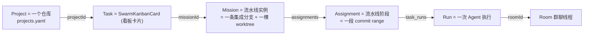
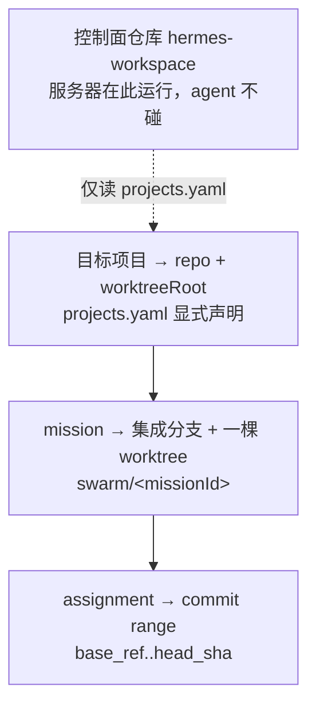
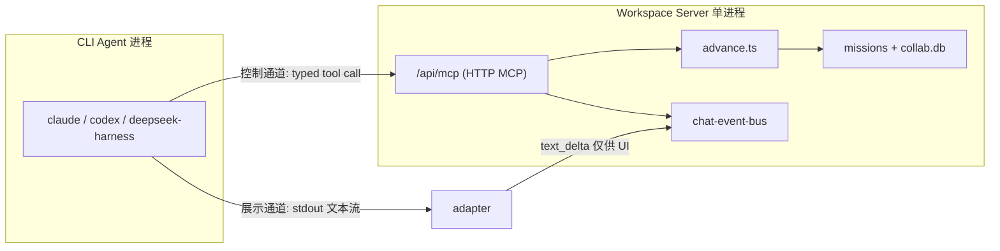
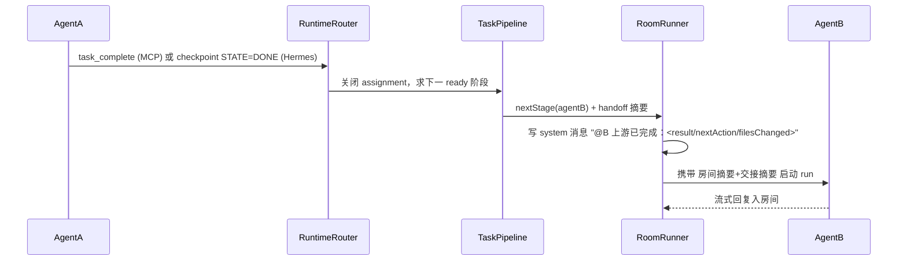
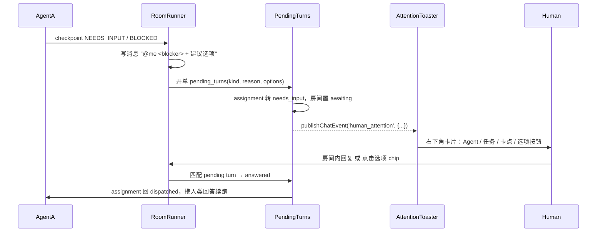

# hermes-workspace 多 Agent 扩展实施计划（方案 C）

> **开发边界标注** (2026-08-27)
>
> - 已完成：P0 地基、P1.1–P1.4 MCP + AgentRuntime 通电与工具组、P2a canonical 流水线任务模块。
> - 正在开发：P2b 工作区/产物/git 模型（从本文档「产物与代码同步」开始的内容）。
> - 尚未开始：P3 三视图、P4 群聊、P5 人工干预、P6 健康与成本、P7 补齐 CLI adapter。
> - 已实际落库主要文件：`src/server/sqlite-helper.ts`、`src/server/collab-db.ts`、`src/server/chat-event-bus.ts`、`src/routes/api/collab-events.ts`、`src/routes/api/mcp-rpc.ts`、`src/server/mcp/*`、`src/server/agent-runtime/*`、`src/server/task-pipeline/*`、`src/routes/api/tasks/*`、`src/routes/api/agents/status.ts`、`agents.yaml`、`pipelines.yaml`。
> - P2a 目标测试：`npx vitest run src/server/agent-runtime src/server/mcp src/server/task-pipeline src/server/collab-db.test.ts src/server/chat-event-bus.test.ts` 通过 21 文件 / 305 例。

## 决策摘要

采用 **方案 C：Hybrid 分层**。新增四层能力，互不耦合、可分期交付：

1. **AgentRuntime 适配层 + MCP 控制面** — 让 Hermes / Claude Code / Codex / DeepSeek Harness 成为对等运行时；语义上报走 typed tool 而非 stdout 文本解析
2. **Task 四级模型** — 看板卡片 → Mission 流水线 → Assignment 阶段 → Run 执行历史
3. **工作区与产物模型** — project 定仓库、mission 定分支与 worktree、assignment 定 commit range，并按 agent 的执行位置（`local` / `ssh`）分派到本机 worktree 或远端工作区；同时修掉今天两个错误：目标仓库被定义成 `process.cwd()`（即控制面自己），以及所有 worker 共享一棵树、冲突静默覆盖
4. **Room 群聊层** — 人类与 Agent 对等参与者 + `@` 路由 + 滚动摘要 + checkpoint 驱动的自动交接与 pending turn

不引入 Rust / Vue 依赖，不嵌入 hermes-studio 或 OpenTeams 进程。三方案对比见文末附录。

---

## 现状复用点（已核实）

| 能力               | 现有实现                                                                                                                                                                      | 本计划如何用                                                           |
| ------------------ | ----------------------------------------------------------------------------------------------------------------------------------------------------------------------------- | ---------------------------------------------------------------------- |
| Mission + 阶段依赖 | [src/server/swarm-missions.ts](hermes-workspace/src/server/swarm-missions.ts)：`dependsOn` 是 id 寻址的真边，`readyQueuedAssignments` 是正确的 ready-set 松弛函数             | **数据模型直接用**，但调度循环尚未接线，见下方地基核查                 |
| 看板卡片           | [src/server/kanban-backend.ts](hermes-workspace/src/server/kanban-backend.ts)：`SwarmKanbanCard` 已含 `missionId` / `assignedWorker` / `reviewer`                             | **卡片即 Task**，`missionId` 就是卡片↔流水线的现成外键                 |
| Agent 实时态       | [src/routes/api/swarm-runtime.ts](hermes-workspace/src/routes/api/swarm-runtime.ts)：`RuntimeEntry`（state / checkpointStatus / needsHuman / currentTask / missionId / tmux） | **全局视图数据源**，补 SSE 推送                                        |
| Checkpoint 契约    | [src/server/swarm-checkpoints.ts](hermes-workspace/src/server/swarm-checkpoints.ts)：`parseSwarmCheckpoint` → `DONE / BLOCKED / NEEDS_INPUT / HANDOFF / IN_PROGRESS`          | **交接与人工干预的触发信号**                                           |
| 交接产物           | [src/server/handoff.ts](hermes-workspace/src/server/handoff.ts)：`memory/handoffs/swarm/<worker>-latest.json`                                                                 | 自动 `@` 时作为上下文摘要来源；`gitDiff` 由工作树快照改为 `base..head` |
| git 只读探测       | [src/routes/api/swarm-project.ts](hermes-workspace/src/routes/api/swarm-project.ts) 的 `rev-parse` / `status --porcelain`；`update-system.ts` 的 fetch/merge 封装             | `git-ops.ts` 沿用其 `execFile` + timeout 风格，不引依赖                |
| 任务分解           | [src/routes/api/swarm-decompose.ts](hermes-workspace/src/routes/api/swarm-decompose.ts)：orchestrator 产出自包含子任务 + 启发式兜底                                           | 改职责为「按模板 stage 生成指令文本」，不再自行挑 worker               |
| SSE 总线           | [src/server/chat-event-bus.ts](hermes-workspace/src/server/chat-event-bus.ts)：`publishChatEvent` / `subscribeToChatEvents(sub, sessionKeyFilter)`                            | 扩一个 `roomId` / `scope` 过滤维度                                     |
| 流式回复           | [src/routes/api/send-stream.ts](hermes-workspace/src/routes/api/send-stream.ts)                                                                                               | Hermes adapter 复用；`registerActiveSendRun` 去重照旧                  |
| Toast              | [src/components/ui/toast.tsx](hermes-workspace/src/components/ui/toast.tsx)（当前 top-right，挂在 [\_\_root.tsx](hermes-workspace/src/routes/__root.tsx)）                    | 加 `position` 变体做右下角提示                                         |

## 地基现状核查（代码级，已核实）

### 流水线调度：原语齐备，循环未接

```416:421:hermes-workspace/src/server/swarm-missions.ts
export function readyQueuedAssignments(missionId: string): Array<SwarmMissionAssignment> {
  const mission = getSwarmMission(missionId)
  if (!mission) return []
  const doneIds = new Set(mission.assignments.filter((item) => ['checkpointed', 'done'].includes(item.state)).map((item) => item.id))
  return mission.assignments.filter((item) => item.state === 'queued' && item.dependsOn.every((id) => doneIds.has(id)))
}
```

这是标准 ready-set 松弛，语义正确。但**全仓零生产调用者**（仅定义 + 一个单测）。`swarm-dispatch` 收下 `dependsOn` 存进 mission，随后把请求内所有 assignment 无条件并发派发，从不查依赖。结论：`dependsOn` 今天是被写入、被测试、从未被执行的字段。

`deriveMissionState` 是对 assignment 数组的**无序聚合归约**，不看 `dependsOn`，只能给看板卡片染色，回答不了「流水线走到哪一格」。Pipeline 视图的当前位置必须自己按 `dependsOn` 拓扑排。

需补的四项：

1. **接 advance 循环** — checkpoint 落库后调用 `readyQueuedAssignments` 并经 Router 派发
2. **stage key → id 两遍解析** — assignment id 在 `createOrUpdateMission` 内部生成，调用方无法在同一请求里引用兄弟节点（单测只能创建后直接改对象：`finalAction.dependsOn = [implementation.id]`）。`pipelines.yaml` 用 stage key 声明依赖，实例化时先建节点再回填边
3. **无环校验** — 成环时 `readyQueuedAssignments` 只会永远返回空数组，流水线静默死亡；校验放在模板加载期
4. **continuation 继承下游边** — `appendMissionContinuation` 当前硬编码 `dependsOn: []`（[swarm-missions.ts:400](hermes-workspace/src/server/swarm-missions.ts)），续跑节点切断血缘，下游永不放行。需加 `dependsOn` 与 `inheritDownstreamFrom` 参数

### 评审链：三条半成品，实际断路

| 环节                    | 现状                                                                                                                                                                                                                               |
| ----------------------- | ---------------------------------------------------------------------------------------------------------------------------------------------------------------------------------------------------------------------------------- |
| `reviewRequired` 怎么来 | 正则猜：`inferReviewRequired` 匹配 task 文本里的 code/patch/implement/pr/benchmarks                                                                                                                                                |
| checkpoint DONE 之后    | assignment 停 `checkpointed`，mission 标 `reviewing`，**然后无任何后续**                                                                                                                                                           |
| 谁写 `state = 'done'`   | 仅 `markMissionAssignmentReviewed` / `markMissionAssignmentsReviewedByWorker`。前者零调用者；后者在 [swarm-orchestrator-loop.ts:10](hermes-workspace/src/routes/api/swarm-orchestrator-loop.ts) 被 import 但**从未调用**（死导入） |
| UI「送评审」按钮        | `routeToReviewer()` 给 swarm6 派一个全新临时任务，**不带 missionId / assignmentId**，评审结论回不到原节点                                                                                                                          |
| `reviewOutcome`         | [swarm-checkpoints.ts:69](hermes-workspace/src/server/swarm-checkpoints.ts) 已解析 `REVIEW_OUTCOME`，消费者只有 `hermes_langgraph_orchestrator/nodes.py`，不回写 mission                                                           |

即：`reviewRequired` 今天只影响显示标签，运行时**不存在任何评审门**。本计划的处置见「评审是节点，不是属性」。

### 产物与代码同步：目标仓库被定义成「服务器在哪」

最要紧的问题不是缺 worktree，而是**目标仓库的定义本身是错的**：

```6:7:hermes-workspace/src/server/swarm-environment.ts
export const SWARM_CANONICAL_REPO = resolve(process.cwd())
export const SWARM_MEMORY_ROOT = process.env.HERMES_SWARM_MEMORY_ROOT || join(homedir(), 'hermes-workspace')
```

`process.cwd()` 是**控制面自己的仓库**（hermes-workspace，这个工具）。而本计划的主用途是用 agent 开发**其他项目**，hermes-workspace 只是工具。`swarm-environment` 的 notes 还进一步强化了这个错误——"Swarm code, git, build, and tests run only in the canonical repo" 等于在告诉所有 agent「去改这个工具」。

因此 `projects.yaml` 不是可选增强，而是**修正这个定义**的必要项：目标仓库必须显式声明，绝不能从 `process.cwd()` 推导。

其余 git 缺口：全仓**零处** `git worktree` 调用，也没有 `checkout -b` / `commit` / `push` / `fetch <remote> <branch>` / 跨 ref diff；git 写操作只存在于 `update-system.ts` 的自更新逻辑里（那也是对控制面自己的仓库操作）。

实测到的四个后果：

1. **worker 是长期角色，不是 per-mission 实体**。`~/.hermes/profiles/<id>/runtime.json` 里是 `state` / `currentMissionId` / `currentAssignmentId`，一次只持有一个 assignment，跨 mission 复用同一个常驻 tmux session
2. **`/api/swarm-project` 的 branch 恒为 null**。它读 `runtime.json` 的 `cwd`（[swarm-project.ts:45](hermes-workspace/src/routes/api/swarm-project.ts)），而实际的 runtime.json 里**没有这个字段**
3. **handoff 的 diff 是未提交的工作树快照**。`SwarmHandoff` 只有 `filesChanged: Array<string>`（绝对路径）与 `gitDiff: string`（`git diff HEAD -- <files>`），全链路无 `branch` / `baseRef` / `headSha`。评审者看到的 diff 会随时变化，说不清评审对象是哪个版本；并行 agent 的改动互相覆盖且**静默**
4. **远端执行已在用，但平台完全不感知**：`~/.hermes/profiles/gpuserver/` 配的是 `terminal.backend: ssh` → `dev-wsl`（10.119.6.11:2222），profile 描述写明「runs terminal/commands on remote GPU machine」。它的 gateway 进程在本机，只有命令在远端。而 `swarm.yaml` 的 worker 列表里**没有它**——既是孤儿 profile，也意味着流水线目前无法把 GPU 任务派给它。`agents.yaml` 加载时需对账并报告孤儿；执行位置的处置见「执行位置」一节

**成本数据不可跨项目推广**：`.git` 127M / pnpm 全局 store 3.9G / `node_modules` 主要是硬链接，这些全是 hermes-workspace 自己的数字。目标项目若用 npm、yarn、cargo 或 gradle，worktree 的安装成本完全不同。因此并发上限与 `setup` 命令必须**按项目配置**，不设全局常量。处置见「产物与代码同步」。

### 任务内容来源：分解器存在，但产出是扁平的

`swarm-decompose` 已经能让 orchestrator 模型把一句话拆成自包含子任务：

```34:36:hermes-workspace/src/routes/api/swarm-decompose.ts
- Output ONLY valid minified JSON matching this shape: {"assignments":[{"workerId":"swarm1","task":"...","rationale":"..."}],"unassigned":["...optional reasons"]}
- Use only the worker IDs that exist in the provided roster.
- Each task must be a complete, self-contained instruction the worker can execute without additional context.
```

但输出只有 `workerId` + `task`，**没有 `dependsOn`**：它能产出内容却产不出结构。而 `pipelines.yaml` 正好相反——有结构没内容。两者互补，处置见模块 1。

### 其他裂缝

- [src/routes/api/swarm-missions.ts](hermes-workspace/src/routes/api/swarm-missions.ts) POST 仅支持 `action: 'cancel'`，但 [swarm2-reports-view.tsx:489](hermes-workspace/src/screens/swarm2/swarm2-reports-view.tsx) 会调 `mark_ready_for_eric` → 静默失败
- 任务语汇双轨：`/api/swarm-kanban`（7 lane）与 `/api/claude-tasks`（`TaskColumn` 6 值）。统一到 kanban lane，`claude-tasks` 降级为 worker 私有队列，不再是任务真源
- [src/hooks/use-chat-stream.ts](hermes-workspace/src/hooks/use-chat-stream.ts) 是空 stub，新 SSE 消费另建 `use-collab-stream`，不去填它

---

## 目标架构

```mermaid
flowchart TB
  subgraph ui [New UI]
    Overview["MissionControl_Overview 全局态势"]
    Board["MissionControl_Board 看板"]
    Pipeline["MissionControl_Pipeline 单任务流水线"]
    Rooms["Rooms 群聊"]
    Toast["AttentionToast 右下角"]
  end
  subgraph core [Workspace Server]
    CollabBus["chat-event-bus + roomId/scope 过滤"]
    TaskSvc["task-pipeline 服务"]
    RoomSvc["group-chat 服务"]
    Router["AgentRuntimeRouter"]
    McpSvc["/api/mcp 控制面 (typed tools)"]
    Watcher["agent-status-watcher + nudge"]
    Budget["token 计量与预算"]
    GitOps["git-ops worktree/分支/合并"]
  end
  subgraph store [Storage]
    Missions["swarm-missions.json 流水线"]
    Kanban["kanban backend 卡片"]
    CollabDb["collab.db rooms/participants/messages/summaries/pending_turns/task_runs"]
    RuntimeJson["profiles/*/runtime.json"]
    Worktrees["per-mission worktrees + 集成分支"]
  end
  subgraph rt [Runtime Adapters]
    Hermes["hermes (gateway/tmux)"]
    Claude["claude-code CLI"]
    Codex["codex CLI"]
    DeepSeek["deepseek-harness CLI"]
  end
  subgraph remote [远端 GPU 机 via ssh]
    RemoteWt["远端 worktree + 产物"]
  end

  Overview --> CollabBus
  Board --> TaskSvc
  Pipeline --> TaskSvc
  Rooms --> RoomSvc
  Toast --> CollabBus
  RoomSvc --> Router
  TaskSvc --> Router
  McpSvc --> TaskSvc
  McpSvc --> RoomSvc
  Router --> Budget
  TaskSvc --> GitOps
  GitOps --> Worktrees
  GitOps -->|"push 分支 / rsync 产物"| RemoteWt
  Hermes -->|"terminal.backend=ssh"| RemoteWt
  TaskSvc --> Missions
  TaskSvc --> Kanban
  RoomSvc --> CollabDb
  TaskSvc --> CollabDb
  Router -->|"cwd = mission worktree"| rt
  Watcher --> RuntimeJson
  Watcher --> CollabBus
  Router --> CollabBus
```



---

## 数据模型（统一四级）



### 新表（`collab.db`）

```sql
CREATE TABLE rooms (
  id TEXT PRIMARY KEY, title TEXT, task_id TEXT, mission_id TEXT,
  workspace_path TEXT, owner_participant_id TEXT,
  created_at INTEGER, updated_at INTEGER
);

-- 人与 Agent 同表，用 kind 区分（与 Studio 的分表设计不同，见「人类是一等参与者」）
CREATE TABLE room_participants (
  id TEXT PRIMARY KEY, room_id TEXT,
  kind TEXT,              -- human | agent
  participant_id TEXT,    -- agents.yaml 的 agent id，或 human:<userId>
  display_name TEXT,
  mention_name TEXT,      -- @ 用的短名，房间内唯一
  description TEXT,       -- 注入 Agent 系统提示的角色说明
  runtime TEXT,           -- agent 才有：hermes | claude-code | codex | deepseek-harness
  is_owner INTEGER DEFAULT 0,
  online INTEGER DEFAULT 0,
  joined_at INTEGER, removed_at INTEGER DEFAULT 0
);
CREATE UNIQUE INDEX idx_participants_mention ON room_participants(room_id, mention_name);

CREATE TABLE room_messages (
  id TEXT PRIMARY KEY, room_id TEXT,
  sender_kind TEXT,       -- human | agent | system
  sender_participant_id TEXT, sender_name TEXT, content TEXT,
  mentions TEXT,          -- JSON: Array<{ type: 'human'|'agent'|'all', participantId?: string }>
  mention_depth INTEGER DEFAULT 0,
  auto_handoff INTEGER DEFAULT 0,   -- 平台自动交接产生的 @，不计入 mention_depth 预算
  task_refs TEXT,                   -- JSON: #<taskId> 解析结果
  answers_pending_turn_id TEXT,     -- 显式作答归属，chip 点击天然携带
  run_id TEXT, task_id TEXT, created_at INTEGER
);
CREATE INDEX idx_room_messages_room ON room_messages(room_id, created_at);

-- MCP 凭证：读写分离，写 token 的粒度是「一次 run」
CREATE TABLE run_tokens (
  token_hash TEXT PRIMARY KEY,     -- 只存 hash，不存明文
  kind TEXT,                       -- read_only | run_write
  run_id TEXT, participant_id TEXT,
  assignment_id TEXT,              -- read_only 时为 NULL
  task_id TEXT, room_id TEXT,
  tool_allowlist TEXT,             -- JSON array
  issued_at INTEGER, expires_at INTEGER, revoked_at INTEGER DEFAULT 0,
  -- reportToken 的幂等重放：相同 payload 重试放行并回放首次结果，不同 payload 拒绝
  consumed_at INTEGER, consumed_payload_hash TEXT, last_response_json TEXT
);
CREATE INDEX idx_run_tokens_run ON run_tokens(run_id, revoked_at);

-- 「等人回话」是一等状态，不只是一条 toast
CREATE TABLE pending_turns (
  id TEXT PRIMARY KEY, room_id TEXT, task_id TEXT, assignment_id TEXT,
  requested_by TEXT,              -- 发起 @ 的 agent participant_id
  target_participant_id TEXT,     -- 被 @ 的人
  message_id TEXT,                -- 房间内那条 @ 消息
  kind TEXT,                      -- needs_input | blocked | approval | review
  reason TEXT,
  options TEXT,                   -- JSON: 建议选项 [{ id, label, replyText }]
  status TEXT,                    -- pending | answered | dismissed | expired
  created_at INTEGER, answered_at INTEGER, answered_message_id TEXT
);
CREATE INDEX idx_pending_turns_open ON pending_turns(status, created_at);
CREATE TABLE room_summaries (
  room_id TEXT PRIMARY KEY, summary TEXT,
  through_message_id TEXT, through_at INTEGER,
  turn_count INTEGER, version INTEGER, updated_at INTEGER
);
CREATE TABLE task_runs (
  id TEXT PRIMARY KEY, task_id TEXT, mission_id TEXT, assignment_id TEXT,
  room_id TEXT, agent_id TEXT, runtime TEXT,
  status TEXT,            -- running | done | blocked | needs_input | failed | cancelled
  started_at INTEGER, ended_at INTEGER,
  summary TEXT, blocker TEXT, next_action TEXT,
  log_path TEXT, checkpoint_json TEXT,
  -- git 产物：diff 对象由 commit range 确定，不再是工作树快照
  project_id TEXT, branch TEXT, base_ref TEXT, head_sha TEXT,
  worktree_path TEXT, files_changed TEXT   -- files_changed: JSON array，仓库相对路径
);
CREATE INDEX idx_task_runs_task ON task_runs(task_id, started_at);
```

`diff_ref` 这个模糊字段被 `branch` + `base_ref` + `head_sha` 取代：一次 run 改了什么等于 `git diff <base_ref>..<head_sha>`，是不可变、可复算、机器无关的。`files_changed` 一律存**仓库相对路径**，绝对路径不跨机也不跨 worktree。

`task_runs` 是「每个任务的处理历史」的唯一真源；mission events 继续保留，Pipeline 视图两者合并渲染。

### 项目声明：`projects.yaml`（新，仓库根）

**必须先区分两个仓库，计划全文按此措辞：**

| 术语             | 指什么                                          | 谁在动它                                                                                                                                         |
| ---------------- | ----------------------------------------------- | ------------------------------------------------------------------------------------------------------------------------------------------------ |
| **控制面仓库**   | hermes-workspace 本身，即运行这个服务器的代码   | 你（人工）。它已有的 worktree（`hermes-workspace [multi-agent]` / `hermes-release [release-branch]`）是**你的开发分支管理**，与 mission 隔离无关 |
| **目标项目仓库** | mission 实际要改的项目，由 `projects.yaml` 声明 | agent                                                                                                                                            |

「不同仓库」的正确粒度是**项目**，不是 mission——同一项目上的多个 mission 共享仓库、各开分支；不同项目才是不同仓库。

```yaml
version: 1
projects:
  - id: my-app
    repo: /abs/path/to/my-app # 必填、必须是绝对路径，不允许省略或写 "."
    defaultBranch: main
    worktreeRoot: /abs/path/to/worktrees/my-app # 必须在 repo 之外
    setup: ['pnpm install --frozen-lockfile'] # 按项目的包管理器写，无默认值
    maxConcurrentWorktrees: 4 # 按项目的安装成本调
    gitRemote: '' # 占位：后续跨机写代码需要共享 remote，P2b 不填
```

`gitRemote` 现在是可选空占位，**但 schema 不锁死**。后续若要支持远端 agent 改代码回推，分支需要一个双方都能访问的 remote（自建 HTTP、GitHub 或 Cursor 托管），届时填这里即可，不必改数据结构。

约束（每条都对应一个具体故障）：

- **`repo` 不允许缺省，也不从 `process.cwd()` 推导。** 这就是修 `SWARM_CANONICAL_REPO` 那个错误定义的地方
- **`worktreeRoot` 必须在 `repo` 之外。** 放在仓库内会让所有 worktree 变成一堆未跟踪目录，污染 `git status` 与 agent 的文件搜索
- **`setup` 无默认值。** 猜包管理器会在非 JS 项目上装出一堆垃圾
- **`maxConcurrentWorktrees` 按项目配。** 安装成本因项目而异，全局常量必然对某些项目错

`Task` / `Mission` 增加 `projectId`（必填，无默认）。`setup` 失败则 mission 直接 `blocked`，不放 agent 进半装好的树。

### 自宿主是例外，必须显式声明

若目标项目**恰好就是控制面仓库**（用 agent 开发 hermes-workspace 自己），需要额外三条硬规则：

1. **服务器不得运行在任何 mission worktree 内部**——否则 `releaseMissionWorktree` 会删掉正在跑的树。启动时校验 `process.cwd()` 不在任一 `worktreeRoot` 下，违反则拒绝启动
2. **控制面仓库自身永不作为 worktree 目标**，mission 一律在独立的 `worktreeRoot` 下建树
3. 这两条到位后，**自宿主反而比今天安全**：今天 agent 直接改 `process.cwd()`，也就是正在运行的服务器源码，每次改动触发 HMR 重启（这正是 `run_tokens` 必须持久化的原因之一）。分开之后服务器那棵树不再被碰

### 运行时声明：`agents.yaml`（新，仓库根）

```yaml
version: 1
agents:
  - id: developer # 复用 swarm.yaml worker id 时自动继承 role/skills
    runtime: hermes
    profile: developer
  - id: gpuserver # 今天是孤儿 profile，必须显式声明
    runtime: hermes
    profile: gpuserver
    execution: ssh # 从 profile 的 terminal.backend 自动探测，此处仅覆写/固定
    capabilities: [gpu, cuda, benchmark, training]
    mentionName: gpu
  - id: cc-impl
    runtime: claude-code
    displayName: Claude Code
    command: claude
    args: ['-p']
    mentionName: claude
  - id: codex-impl
    runtime: codex
    command: codex
    mentionName: codex
  - id: ds-harness
    runtime: deepseek-harness
    command: deepseek-harness
    mentionName: deepseek
```

`swarm.yaml` 保持不变（Hermes 流水线真源），`agents.yaml` 只描述**运行时如何拉起**，避免破坏 [sync-swarm-profiles.mjs](hermes-workspace/scripts/sync-swarm-profiles.mjs)。

`capabilities` 缺省时从 `swarm.yaml` 继承——那里已有齐全的 `capabilities` / `preferredTaskTypes` / `maxConcurrentTasks` / `greenlightRequiredFor`（见 `developer` 条目）。`execution` 缺省时读 `~/.hermes/profiles/<id>/config.yaml` 的 `terminal.backend` **自动探测**，不重复配置。

### 流水线模板：`pipelines.yaml`（新，仓库根）

```yaml
version: 1
pipelines:
  - id: default-build
    name: 需求到交付
    stages:
      - key: research
        agent: researcher
        dependsOn: []
      - key: spec
        agent: architect
        dependsOn: [research]
      - key: build
        agent: developer
        dependsOn: [spec]
      - key: review # 评审是节点，不是属性
        agent: architect # 也可写 human:me → 落成 pending_turns 等人拍板
        kind: review # 解析 REVIEW_OUTCOME，approved 放行 / changes_requested 打回
        reworkTarget: build
        dependsOn: [build]
      - key: retro
        agent: learning
        dependsOn: [review] # 关键：下游依赖 review，而非 build
```

实例化分两遍：先按 stage 顺序建 `SwarmMissionAssignment` 拿到 id，再把 stage key 翻译成 assignment id 回填 `dependsOn`。之后**流水线推进直接复用 `readyQueuedAssignments`**，不另造调度器。

### advance 的并发语义（必须先定，否则 fan-in 必然双派）

`checkpoint 落库 → readyQueuedAssignments → 派发` 这条链路存在明确的竞态：**菱形汇合时两个上游 checkpoint 几乎同时落库，两次 advance 会各自算出同一个 ready 节点并都去派发**。mission store 是 JSON 文件 + atomic rename，读-改-写不加锁还会丢更新。三条规则：

**1. per-mission 串行。** `withMissionLock(missionId, fn)` 包住「读 mission → 算 ready → 写状态 → 派发」整段，不只是写。同一 mission 的 advance 排队，不同 mission 并行。因为 workspace server 是单进程，进程内 mutex 足够；但锁必须覆盖 mission store 的读-改-写全程，否则 atomic rename 只保证文件不撕裂、不保证没有丢更新。

**2. 派发幂等靠 CAS，不靠锁。** 锁只防同进程竞态，防不住 server 重启后的重复推进（detached agent 仍在跑）。因此状态转移必须是条件写：

```
UPDATE assignment SET state='dispatched', run_id=<newRunId>
WHERE id=<assignmentId> AND state='queued'
```

只有 CAS 成功的那一方才真正 spawn 进程。失败方直接返回，不报错、不重试。`run_id` 在 spawn **之前**写入，这样即使 spawn 崩了也能查到这次尝试，而不是留下一个状态是 `dispatched` 但没有任何 run 记录的孤儿。

**3. 幂等键是 `(assignmentId, attempt)`。** 即 `runId`。重派递增 `attempt`，这与 `run_tokens` 的「一次 run 一个写 token」天然对齐——旧 token 吊销与新 run 的 CAS 是同一个事务边界内的两件事。

上面的 `UPDATE` 是概念写法：mission 今天仍在 `swarm-missions.json` 里，实现是锁内读-改-写 + `state === 'queued'` 才提交 rename。

### 双存储与崩溃恢复（CAS 覆盖不了这条路径）

`task_runs` 在 `collab.db`（SQLite 事务），mission 状态在 `swarm-missions.json`（atomic rename），**不是同一个事务**。`withMissionLock` 只防进程内竞态。

危险窗口是「SQLite 已有 `running` 行、JSON 仍是 `queued`」：重启后 CAS 会成功再 spawn，而已 spawn 的 detached 进程可能还活着。风险表里「重派后新旧进程双写」只覆盖**主动重派**，不覆盖这条崩溃恢复路径。

**写顺序（缩小危险窗口）：**

1. JSON CAS：`queued → dispatched`，先盖上 `run_id`
2. SQLite：`INSERT task_runs status='running'`
3. 最后才 `spawn`

这样崩溃最常见的残留是「已 dispatched、没有 running 行」——**不会双派**，只会卡住。反过来的「queued + running」只应出现在旧 bug 或人为改库，启动对账仍要处理。

**启动对账**（P2a 落地，`src/server/task-pipeline/reconcile.ts`，server listen 之前跑完）：

| 发现                                                          | 处置                                                                                                                      |
| ------------------------------------------------------------- | ------------------------------------------------------------------------------------------------------------------------- |
| `task_runs.status='running'` 且 assignment 仍 `queued`        | 记这条 run 为 `failed`（原因 `crash_orphan`），**禁止对该 assignment 做 CAS 派发**；有 pid 则杀进程组；开 `pending_turns` |
| assignment `dispatched` 且没有对应 `task_runs`                | 未 spawn。把 assignment 退回 `queued`，记事件 `dispatch_incomplete`，下一次 advance 可以再派（这是安全方向）              |
| `running` 行 + assignment `dispatched` + pid 注册表里进程已死 | run 标 `failed`；assignment 转 `blocked` + `pending_turns`，**不自动重派**（不知道半成品工作树处于什么状态）              |
| `running` 行 + 进程仍活                                       | 重新挂接 PTY / 统计，不改状态                                                                                             |

主动重派仍走原规则：先吊销旧 token、再 CAS 新 attempt。对账与主动重派共享「先处理旧 run、再允许新 CAS」。

**演进路线（P0 就要写进代码注释与本计划，本阶段不迁数据）：**

- **现在**：mission JSON 是流水线真源，`collab.db` 是 run/房间/token 真源。双写是已知负债
- **P2a**：对账 + 写顺序把负债变成可恢复，而不是假装事务
- **中期（本计划不交付）**：`missions` / `assignments` 迁进 `collab.db`，与 `task_runs` 同库事务；JSON 降为导出缓存或删除。`lane-sync`、一致性脚本、归档届时只对一种存储写

P0 建 `collab.db` 时在 schema 头注释写明上述路线，并预留 `schema_migrations` 表（kanban 已有同类需求则可复用），**不建空的 missions 表**——空表比双真源更误导。

同样的 CAS 纪律适用于两处已知的并发点：`review.ts` 的打回（review 置 `cancelled` 与新节点创建必须在同一把锁内，否则 retro 可能在中间态被误放行）、以及 `mergeSiblings` 的汇合（合并结果作为下游 `base_ref` 写入，必须与放行下游同锁）。

P2a 的单测矩阵里要专门加一条：**并发 fan-in**——模拟两个上游 checkpoint 同时到达，断言下游只被派发一次。

### 评审是节点，不是属性

`reviewRequired` 布尔值退休。「要不要评审」变成「模板里有没有 review 这一格」，不再依赖正则猜任务文本。这带来三个连带收益：

- **门是拓扑的，不是状态检查的**。`readyQueuedAssignments` 把 `checkpointed` 计入满足态这件事**不需要改**——因为 `retro` 依赖的是 `review` 而不是 `build`，build 报完 DONE 只会放行 review，放行不了 retro。门由边的走向保证，比在调度函数里加状态特判更稳。
- **`reviewOutcome` 第一次真正接上电**。已经在解析的 `REVIEW_OUTCOME: approved | changes_requested` 成为 advance 循环的判据。
- **评审者可以是人**。`agent: human:me` 时，review stage 不派 CLI，而是开一条 `pending_turns`（`kind: 'review'`），右下角弹提示等人拍板。人工审批与 Agent 审批走同一套机制，不写第二套逻辑。

`changes_requested` 的打回语义（必须精确，否则会漏放行）：

1. review assignment 置 `cancelled` —— 关键是让它**离开 `doneIds`**，否则 retro 会被误放行
2. `appendMissionContinuation` 给 `reworkTarget`（build）的 agent 开新节点，携带 reviewer 的意见
3. 再开一个新的 review 节点，`dependsOn` 指向该 continuation，并**继承原 review 的下游边**（retro 改指向新 review）
4. 循环上限默认 3 轮，超出则整条流水线转 `blocked` 并开 `pending_turns` 请人介入

---

## 产物与代码同步（git 模型）

三层粒度，各自对应一个已有实体：



**worktree 隔离的是 mission，不是同一个 mission 里的 agent。** 同一条流水线里 research → spec → build → review 全部 `cwd` 指向**同一棵** mission worktree，接力改同一份文件，这正是你说的「大家应该在同一个 worktree 上干活」。格子之间的差别只是提交区间：`base_ref..head_sha` 标出「这一格从哪改到哪」，不是另开一棵目录。

没有 worktree、只在主 checkout 上切分支不够，因为 **一个目录同一时刻只能 checkout 一条分支**。两个 mission 并行时，A 要看 `swarm/mission-a` 的文件，B 要看 `swarm/mission-b` 的文件，再加服务器自己可能停在 `main` 上跑 `pnpm dev`——三者不能挤在同一个工作目录里。worktree 就是 git 提供的「同一仓库、多份已 checkout 的工作目录」：object 共享，目录分开。

对照：

| 共享范围                | 今天实际发生的事                                                                | 计划里的 worktree                                           |
| ----------------------- | ------------------------------------------------------------------------------- | ----------------------------------------------------------- |
| 同一 mission 的各 agent | 没有按 mission 分目录；平台只在 prompt 里写「到 canonical repo 干活」           | **同一棵 mission worktree**                                 |
| 两个并行 mission        | 同样没有分目录，两件任务的未提交改动会搅在一起                                  | **各有一棵树**                                              |
| 服务器自己的源码目录    | `SWARM_CANONICAL_REPO = process.cwd()` 把控制面仓库**误标成**「该去干活的地方」 | 分开：目标项目由 `projects.yaml` 声明，agent 不碰控制面仓库 |

今天并不是「所有 mission 都 checkout 在服务器那棵树上」这么整齐。tmux 启动时 `resolveWorkerCwd` 读 wrapper 里的 `cd`，而现有 wrapper 只是 `exec hermes -p <id>`，读不到就回落到 **家目录**。真正绑死的是 prompt 策略：notes 要求代码改动发生在 `process.cwd()`（控制面仓库）。所以现状是「没有 per-mission 工作区 + 还指错了目标仓库」，不是「精心设计的共享主树」。这两者都应当改掉。

唯一的例外是**同一 mission 里两个互不依赖、还都要改代码的格子真正并行**。一棵工作目录装不下两份未提交改动，这时才需要子分支（计划里的 `swarm/<missionId>/<workerId>`）。线性链（默认模板）用不到这个例外。

### 为什么是 worktree 而不是 per-mission clone

worktree 与 clone 的物理隔离收益完全相同（并行 mission 不再互相踩树），但 worktree 共享同一个 object store，省掉每个 mission 一份 `.git` 的拷贝，也省掉一次完整的远程抓取。

依赖安装这一项**取决于目标项目的包管理器**，不能一概而论：pnpm、yarn PnP 这类内容寻址方案增量很小，npm、cargo、gradle 则要付实打实的成本。所以 `maxConcurrentWorktrees` 是**按项目配置**的，安装贵的项目就把并发压到 1～2，mission 排队等。

### `workspaceMode`：一个 mission 只有一种工作区语义

`worktree` 与 per-run 托管进程天然同构——进程 spawn 时把 `cwd` 设成该 mission 的 worktree 即可，结束就回收。而 Hermes 的常驻 tmux worker 与 worktree 有真实张力：换 mission 要 `cd`，会打断它的 dev server 与终端上下文。

**不做「一个 mission 里两种 cwd 语义」的混合方案**——那会让 `advance` 与 `lane-sync` 每一处都要分支判断，复杂度翻倍。改为在 **pipeline 级二选一**，模板加载期静态校验：

```yaml
- id: default-build
  workspaceMode: worktree # worktree | canonical
```

| `workspaceMode` | 工作区                      | 可用 agent                                                                                                                                            | `base_ref` / `head_sha`              |
| --------------- | --------------------------- | ----------------------------------------------------------------------------------------------------------------------------------------------------- | ------------------------------------ |
| `canonical`     | 沿用今天的行为，无 worktree | 全部，含本机 Hermes tmux worker                                                                                                                       | **不提供 commit-range diff**（见下） |
| `worktree`      | per-mission worktree        | **仅托管进程 adapter**（claude-code / codex / deepseek）与 `ssh` locality 的远端 worktree agent。**本机 Hermes tmux worker 在此类 pipeline 中不可用** | 一等公民，参与合并与 diff            |

校验放在 `pipeline-templates.ts`：`workspaceMode: worktree` 的模板里若出现本机 Hermes worker，**加载即报错**，而不是运行时才发现。

这个划分正好对上阶段切分：**P2a 只支持 `canonical`**（新任务模块先在既有执行语义上跑通调度、评审、看板同步），**P2b 才启用 `worktree`**。所以 P2a 期间 Hermes 路径零改动。

**canonical 在本计划里是兼容层，不是第二套 git 语义。** 本机 Hermes tmux worker 本计划明确不动，所以带 Hermes 的流水线会一直跑在 canonical 上；但它不是 worktree 的简化版——共享工作树上记下的 sha 只是当时 HEAD 快照，不能当 `base_ref..head_sha` 用，也不能参与 `mergeSiblings`。

因此：

- 新模板默认 `worktree`（P2b 起）
- 含本机 Hermes tmux worker 的模板必须显式 `canonical`
- `GET /api/git/diff` 对 canonical 任务返回 **409** `{ error: 'workspace_mode_unsupported', workspaceMode: 'canonical' }`，**不返回** `git diff HEAD` 冒充阶段 diff
- Pipeline 时间线在 canonical 任务上不渲染 diff 链接，文案为「共享工作树，无阶段 diff」
- 废弃不在本计划交付：等 Hermes 也有托管进程 adapter 之后，才能把 Hermes 流水线切到 `worktree` 并删除 `canonical`。在那之前它是一等**兼容模式**，在 git 评审入口上是诚实的二等公民

`runtime.json.cwd` 这个字段（今天被 `/api/swarm-project` 读但从无人写）只在 `worktree` 模式下由 adapter 写入，`canonical` 模式保持为空。

**`swarm-environment.ts` 注入给 agent 的 notes 要按模式分叉**：现在那句 "Swarm code, git, build, and tests run only in the canonical repo" 在 `worktree` 模式下必须替换为当前 mission 的 worktree 路径，否则会把 agent 指回控制面仓库。

### 执行位置：本机 worktree 与 ssh 远端工作区

**agent 的进程在哪、文件系统在哪，是两个独立的问题。** `gpuserver` 就是现成的例子——它的 Hermes gateway 跑在本机（`gateway.pid` 里 `hermes_home` 指向本地 profile），只有 `terminal` 工具的命令通过 SSH 落到远端 GPU 机：

```
terminal:
  backend: ssh
  cwd: /home/ramonjing
  ssh_host: dev-wsl        # → 10.119.6.11:2222
  persistent_shell: true
```

三种 locality，必须显式建模，否则 P2b 会做出一个只对本机成立的设计：

| locality | agent 进程 | 文件系统与命令 | 例子                   | 本计划                               |
| -------- | ---------- | -------------- | ---------------------- | ------------------------------------ |
| `local`  | 本机       | 本机 worktree  | developer、claude-code | P2b                                  |
| `ssh`    | **本机**   | **远端仓库**   | gpuserver              | **P2b（与本机同期）**                |
| `relay`  | 远端       | 远端           | Studio `agent-relay`   | 不做；远程参与者只读，见「关于跨机」 |

**`ssh` locality 仅限 `runtime: hermes`。** 「MCP 成本为零」的依据是 gateway 在本机、只有 terminal 走 ssh。这对 claude-code / codex **不成立**——它们的进程就是执行者，若再配 `execution: ssh`，MCP 端点必须对外暴露，整套 `127.0.0.1` + env 注入都要改。

因此 `agents.yaml` **加载期**校验：`runtime !== 'hermes' && execution === 'ssh'` 直接报错。`execution` 缺省并从 profile 的 `terminal.backend` 探测到 ssh、但 runtime 不是 hermes 时，同样拒绝。本计划不给新 CLI adapter 开 ssh 后端。

**`ssh` locality 的 MCP 成本为零（仅 Hermes）。** 要调 MCP 的是本机 gateway，不是远端机器，所以 `127.0.0.1` 端点、token 注入、进程生命周期全部照旧。

真正要新增的是三件事：

**1. 远端仓库位置由 project 声明。** `projects.yaml` 的项目增加 `remotes` 段，把 locality 映射到远端仓库路径：

```yaml
- id: my-app
  repo: /abs/path/to/my-app
  worktreeRoot: /abs/path/to/worktrees/my-app
  remotes:
    dev-wsl: # 键 = ssh host alias，与 profile 的 ssh_host 对齐
      repo: /home/ramonjing/repos/my-app # 远端裸仓库或主仓库
      worktreeRoot: /home/ramonjing/worktrees/my-app
      setup: ['pip install -r requirements.txt'] # 远端的 setup，与本机不同
```

**2. `git-ops` 抽出执行上下文。** 现有函数签名从「路径」改为「上下文」：

```ts
type GitContext =
  | { locality: 'local'; cwd: string }
  | { locality: 'ssh'; host: string; cwd: string }
```

实现上就是给 `execFile('git', args)` 加一层前缀包装成 `execFile('ssh', [host, 'git', '-C', cwd, ...args])`，仍然不引依赖。**每个 git 函数都必须走 `GitContext`**，不允许有直接收裸路径的版本——那是本机专属设计漏进来的入口。

**3. 代码单向过去，产物单向回来。**

```mermaid
sequenceDiagram
  participant L as 本机 workspace
  participant R as 远端 GPU 机
  L->>R: git push <ssh-remote> swarm/&lt;missionId&gt;
  L->>R: ssh git worktree add &lt;remote worktreeRoot&gt;/&lt;missionId&gt; &lt;base_ref&gt;
  L->>R: ssh 跑该项目远端 setup
  R->>R: agent 在远端 worktree 内执行（nvidia-smi / 训练 / benchmark）
  R-->>L: rsync 产物到 memory/swarm/missions/&lt;missionId&gt;/&lt;worker&gt;/
  R-->>L: task_complete (MCP，由本机 gateway 发出)
```

要点：

- **代码不回推。** 远端是只读消费者，`head_sha` 等于它 checkout 的那个 `base_ref`，`files_changed` 为空。若某天需要远端改代码，再加反向 push，本模型不必推翻
- **远端也用 worktree，不是直接 checkout 主仓库。** 因为 `git push` 到非裸仓库的当前分支会被 `receive.denyCurrentBranch` 拒绝；推到远端后在独立 worktree 里 checkout 可以绕开，且顺带获得并行隔离
- **产物走 rsync，不进 git。** checkpoint、metrics、日志这类大文件不该污染仓库历史。落点复用已有的 `memory/swarm/missions/<missionId>/<worker>/` 目录约定（[swarm-mission-artifacts.ts](hermes-workspace/src/server/swarm-mission-artifacts.ts)），回传后写入 `task_runs`，Pipeline 视图的时间线直接可点
- **远端 setup 与本机不同**，因此 `setup` 在 `remotes` 段里单独声明（GPU 机大概率是 pip/conda 而非 pnpm）

### Capability 路由：stage 声明能力，不硬绑 agent

`pipelines.yaml` 原本让 stage 硬绑 `agent: developer`，这样「换台机器跑」就得改模板。改为可二选一：

```yaml
- key: benchmark
  requires: [gpu] # 按能力选人，调度器从 agents.yaml/swarm.yaml 匹配
  dependsOn: [build]
- key: build
  agent: developer # 也允许继续硬绑
  dependsOn: [spec]
```

数据基础已经齐备（`swarm.yaml` 的 `capabilities` / `preferredTaskTypes` / `maxConcurrentTasks`），`advance.ts` 在派发时按 `requires` 过滤候选、再按 `maxConcurrentTasks` 与当前负载择一。无候选时不静默挂起，而是开 `pending_turns` 说明「没有具备 gpu 能力的在线 agent」。

### 大多数阶段不需要合并

同一条依赖链是**线性追加提交**，不是并行分叉：`build` 的 `base_ref` 直接继承 `spec` 的 `head_sha`，链条上没有任何合并动作。真正的合并点只有两个：

| 合并点                         | 谁来合       | 时机                                                                              |
| ------------------------------ | ------------ | --------------------------------------------------------------------------------- |
| 并行兄弟格子汇合               | 平台自动     | `readyQueuedAssignments` 判定「上游全部完成」的那一刻——依赖图已经声明了汇合点在哪 |
| mission 分支 → `defaultBranch` | **始终人工** | 最后一个 review 节点 `approved` 之后，给出 CTA，绝不自动                          |

并行兄弟格子各自开子分支 `swarm/<missionId>/<workerId>`；汇合时平台把它们合进 mission 集成分支，合成结果即下游格子的 `base_ref`。

**合并冲突不需要新机制**：自动合并失败即开一条 `pending_turns`（`kind: 'blocked'`，`reason` 带冲突文件列表），走模块 4 已有的右下角提示。这比今天严格更好——今天两个 agent 踩同一棵树，冲突是静默的，后写的直接覆盖前面的。

不做 rebase，保留 merge commit：提交历史里「哪一格改了哪些行」的归属信息，正是单任务流水线视图与任务历史要展示的东西。

### `git-ops` 模块（`src/server/git-ops.ts`）

继续用 `execFile` 直调 git CLI，**不引入 `simple-git`**——仓库现有 git 调用全是这个风格，且都带 timeout。新增能力：

| 函数                                           | 用途                                                                                                                               |
| ---------------------------------------------- | ---------------------------------------------------------------------------------------------------------------------------------- |
| `resolveProject(projectId)`                    | 解析 `projects.yaml`；校验 `repo` 是绝对路径且是 git 仓库、`worktreeRoot` 在 `repo` 之外、`process.cwd()` 不在 `worktreeRoot` 之下 |
| `gitContextFor(agentId, projectId, missionId)` | 按 agent 的 `execution` 返回 `GitContext`（`local` 或 `ssh`），并解析对应的 `worktreeRoot`                                         |
| `ensureMissionWorktree(ctx, missionId)`        | `git worktree add` + 跑该 locality 对应的 `setup`；受 `maxConcurrentWorktrees` 限流；幂等                                          |
| `pushBranchToRemote(projectId, host, branch)`  | `ssh` locality 的代码投递；推到远端仓库供其 checkout                                                                               |
| `resolveHead(ctx)`                             | 阶段开工/收工时取 sha，写入 `base_ref` / `head_sha`                                                                                |
| `commitStage(ctx, message)`                    | agent 未自行提交时兜底提交，保证阶段边界有 sha（`ssh` 只读场景跳过）                                                               |
| `mergeSiblings(missionId, branches[])`         | 汇合；返回冲突文件列表供 `pending_turns` 使用（仅 `local`）                                                                        |
| `diffRange(ctx, base, head)`                   | 取代 `handoff.ts` 的 `git diff HEAD`                                                                                               |
| `pullArtifacts(host, missionId, workerId)`     | rsync 远端产物回 `memory/swarm/missions/<missionId>/<worker>/`                                                                     |
| `releaseMissionWorktree(ctx, missionId)`       | 合并入主干后 `worktree remove`；`ssh` 侧同样要回收                                                                                 |

MCP 侧有个顺风：`task_complete` 是 **typed tool**，可以直接把 `headSha` 和 `filesChanged` 声明成必填参数并用 zod 校验，新 adapter 完全不必解析文本。只有 Hermes 的 checkpoint 文本路径需要额外补这两个字段（`FILES_CHANGED` 已有，缺 sha，由 `resolveHead` 在服务端补，不依赖模型自述）。

### 评审看 diff：先 API，UI 后置

`GET /api/git/diff?projectId=&base=&head=&path=` 返回 unified diff。人工评审用自己的终端或让 reviewer agent 调它；`files-screen.tsx` 里的 `DiffModal` 是编辑器保存前的行对比、与 git 无关，**不复用也不改**。前端 diff viewer 留到后续，不进本计划。

---

## AgentRuntime：控制通道与展示通道分离

**核心决策：语义上报走 MCP typed tool，不走 stdout 文本解析。** 借鉴 [777genius/agent-teams-ai](https://github.com/777genius/agent-teams-ai) 的 `mcp-server` 设计（见文末借鉴来源）。

原因：让 Claude Code / Codex 在 stdout 里吐 `STATE: / FILES_CHANGED: / RESULT:` 再正则解析，是在赌模型记得格式，且上下文压缩后必然退化。改成 agent **调用**我们的工具后，参数由 zod 校验，格式错误当场报错而非静默失活。



**两个通道职责严格分开**：控制通道决定状态机怎么走，展示通道只喂 UI。展示通道解析失败最多是 UI 少几行字，不会让流水线卡死。

**硬规则：展示通道事件永不落库。** `text_delta` / `thinking` / `tool` 只经 `chat-event-bus` 广播给在线订阅者，过期即丢。落库的只有三类：控制通道的状态转移（`task_runs`）、房间消息（`room_messages`）、以及 run 的开始/结束边界。原因是 `text_delta` 的频率是每秒数十条量级，落库会让 `collab.db` 在几个小时内膨胀到不可维护，而它的价值在流式当下、不在事后。需要事后回看逐字输出的场景由 `task_runs.log_path` 指向的文件承担，不进数据库。

### 为什么必须是 HTTP MCP，不能是 stdio

mission store 是 JSON 文件 + atomic rename。若每个 agent spawn 一个 stdio MCP 子进程，N 个进程并发写同一个 `swarm-missions.json` 会丢更新。HTTP 模式把 MCP endpoint 挂在**现有 workspace server 上**（新增路由 `src/routes/api/mcp.ts`），不新增进程、不新增状态副本、复用现有 auth 中间件。

### 类型契约

```ts
// src/server/agent-runtime/types.ts
export type AgentRuntimeKind =
  | 'hermes'
  | 'claude-code'
  | 'codex'
  | 'deepseek-harness'

// 展示通道：只喂 UI，不驱动状态机
export type AgentStreamEvent =
  | {
      type: 'run_started'
      runId: string
      agentId: string
      taskId?: string
      roomId?: string
    }
  | { type: 'text_delta'; runId: string; text: string }
  | { type: 'thinking'; runId: string; text: string }
  | {
      type: 'tool'
      runId: string
      phase: 'start' | 'end'
      name: string
      args?: unknown
    }
  | { type: 'run_exited'; runId: string; exitCode: number | null }
  | { type: 'error'; runId: string; message: string }

export interface AgentRuntimeAdapter {
  kind: AgentRuntimeKind
  probe(): Promise<{ available: boolean; version?: string; detail?: string }>
  /** 注入 MCP 端点与 runToken，spawn 进程 */
  startRun(
    input: AgentRunInput & { mcp: McpHandshake },
  ): Promise<{ runId: string }>
  streamEvents(runId: string): AsyncIterable<AgentStreamEvent>
  interrupt(runId: string, reason: string): Promise<void>
}

export type McpHandshake = {
  endpoint: string // http://127.0.0.1:<port>/api/mcp
  runToken: string // 短期 token，服务端映射到 participantId + assignmentId
  toolAllowlist: string[] // 按角色裁剪，reviewer 才拿得到 review_approve
}
```

### MCP 工具集（`src/server/mcp/tools/`）

按 Agent Teams 的分组裁剪，去掉我们不需要的 cross-team / org：

| 组      | 工具                                                                                        | 说明                                            |
| ------- | ------------------------------------------------------------------------------------------- | ----------------------------------------------- |
| task    | `task_get` / `task_start` / `task_complete` / `task_add_comment` / `task_set_clarification` | `task_set_clarification` 直接开 `pending_turns` |
| review  | `review_request` / `review_start` / `review_approve` / `review_request_changes`             | 对应「评审是节点」的四个转移                    |
| message | `message_send`                                                                              | 写房间消息，支持 `mentions` 与 `taskRefs`       |
| sync    | `member_work_sync_status` / `member_work_sync_report`                                       | 见下方双阶段校验                                |
| kanban  | `kanban_get`                                                                                | 只读，给 agent 看全局                           |

### 三个防幻觉/防串台机制

**1. 身份先行（`owner_guard` 的前提）。** Agent Teams 用一个 `from` 字符串让 agent 自报身份，我们不照抄——**agent 声明的身份不可信，不是因为会撒谎，而是因为会搞混**：上下文压缩后它可能照着房间历史里别人的发言，把自己当成 architect 去关别人的阶段。

**token 粒度 = 一次 run**，即 `(assignment, 第几次派发)`：

| 粒度               | 为何不选                                          |
| ------------------ | ------------------------------------------------- |
| Task（卡片）       | 跨多阶段多 agent，等于任何参与者都能关任何阶段    |
| Assignment（阶段） | 已确定唯一 agent，但重派时新旧进程会持有同一凭证  |
| **Run（选定）**    | 重派即作废旧 token，僵尸进程的调用被 403 并记事件 |

最后一行是关键：僵尸检测靠抓屏猜，本来就会误判。误判后重派，旧进程若还活着且持有有效凭证，两个进程会互相覆盖状态。绑在 run 上则旧 token 立即失效，我们还顺带知道了它没死。

派生要求：

- **读写分离双 token**：`read_only` 挂在 agent 上、长期有效、只含 `kanban_get` / `task_get`（供空闲 agent 主动看板）；`run_write` 随 run 签发、随 run 失效、覆盖所有改状态的工具
- **必须持久化**：agent 进程是 detached 的，dev 时 HMR 每改一行就重启 server；若 token 只在内存，重启后存活的 agent 全部上报被拒，而你无法给运行中的进程重新注入 env。故落 `run_tokens` 表，存 hash
- **绝不能存在 agent 级位置**：roster 的 `maxConcurrentTasks` 一旦放开，同一 agent 会同时持有多个有效写 token，因此只能随 run 走 env
- 校验顺序：解析 token → 取出 `assignmentId` → **忽略 agent 传来的 taskId，以 token 为准**（传了对不上的直接拒）

**2. 双阶段 sync + 议程指纹。** 心跳与完成必须拆开。agent 先调 `member_work_sync_status` 拿当前议程和 `agendaFingerprint` + 一次性 `reportToken`，再调 `member_work_sync_report(state, agendaFingerprint, reportToken)` 汇报。上下文里的陈旧信息对不上指纹就报不进去。参照原实现的措辞，`member_work_sync_report` **永不完成任务**，它只回答「我还在正轨上 / 我卡住了 / 我没活了」三选一。

我们今天的 checkpoint 把心跳和关单混在一个 `STATE:` 字段里，`DONE` 既表示活着又表示干完了，这是设计缺陷，借此机会拆开。

**「拒绝」不是终点，必须告诉 agent 下一步做什么。** 两种失败要区分处理：

| 情况                     | 响应                                                                                                                 | 依据                                                                              |
| ------------------------ | -------------------------------------------------------------------------------------------------------------------- | --------------------------------------------------------------------------------- |
| `agendaFingerprint` 过期 | 拒绝，且响应里带 `nextRequiredToolCall: member_work_sync_status`（预填参数）+ 一句「议程已变更，请重新获取后再汇报」 | 复用下面第 3 点的机制。若只回一个错误码，agent 极可能拿旧 agenda 原样重试，死循环 |
| `reportToken` 已使用     | **看 payload 决定**，见下                                                                                            |

**`reportToken` 的一次性与网络重试冲突，必须做幂等重放。** 「一次性」若实现成「用过即拒」，那么 agent 侧一次超时重试就会被误判为重放：

- 同一 `reportToken` + **相同 payload 哈希** → 幂等重放，返回**首次的结果**（含当时的 `nextRequiredToolCall`），不重复产生副作用。窗口 60 秒
- 同一 `reportToken` + **不同 payload** → 真正的越权/串台，拒绝并记事件
- 超出窗口 → 按过期拒绝，并同样附上 `nextRequiredToolCall: member_work_sync_status`

落库形态：`run_tokens` 增补两列 `consumed_at` 与 `consumed_payload_hash`，另存一份 `last_response_json` 供重放返回。不新开表。

**3. 工具返回值内嵌下一步。** 响应里带 `nextRequiredAction` 文案与 `nextRequiredToolCall`（工具名 + 预填参数）。这样两步协议不依赖 system prompt 存活——上下文压缩后 prompt 里的协议说明可能已经没了，但工具返回值就在眼前。自动交接同理：agent 完成时，工具结果直接告诉它下一棒是谁。

### 执行后端：CLI adapter 走 per-run 托管进程，不走 tmux

**决策**：新 CLI adapter 用 `spawn` 起 per-run 托管进程（`detached: true` + 独立进程组），Hermes 的 tmux 路径**完全不动**。

关键在于「只有 tmux 才能 attach 观察」在本仓库不成立——PTY 基础设施已经存在且在用：[terminal-sessions.ts](hermes-workspace/src/server/terminal-sessions.ts)（POSIX 走 [pty-helper.py](hermes-workspace/src/server/pty-helper.py)，Windows 直接 spawn）把输出经 EventEmitter 推给 [xterm-client.ts](hermes-workspace/src/lib/xterm-client.ts) 与 [terminal-workspace.tsx](hermes-workspace/src/components/terminal/terminal-workspace.tsx)。托管进程直接接进这套即可，等价于 `tmux attach`。

选托管进程的四条理由，按重要性：

| 维度          | 托管进程                                                                                                                                             | 长驻 tmux                                                                                                                                                          |
| ------------- | ---------------------------------------------------------------------------------------------------------------------------------------------------- | ------------------------------------------------------------------------------------------------------------------------------------------------------------------ |
| runToken 注入 | spawn env，天然 per-run 隔离                                                                                                                         | session env 创建时设一次；换 token 只能 `send-keys export`，而 pane 内容正被 `recentLogTail` 抓成日志                                                              |
| 异常路径      | 有 exit code + stderr，能区分「死了」与「卡住了」                                                                                                    | 只能超时 + 抓屏启发式（现有 `❯` 提示符那套）                                                                                                                       |
| 中断          | `process.kill(-pid, 'SIGKILL')` 杀整组，[mcp-cli-bridge.ts](hermes-workspace/src/server/mcp-cli-bridge.ts) 已有范式且专门处理了 MCP stdio 孙进程孤儿 | 发 C-c 不可靠——[swarm-dispatch.ts](hermes-workspace/src/routes/api/swarm-dispatch.ts) 注释明确 "Do NOT send Ctrl-C here. Hermes prompt_toolkit treats C-c as exit" |
| 输入投递      | 管道写入，`claude -p` / `codex exec` 本就是非交互模式                                                                                                | 模拟键盘：多行粘贴会进 prompt_toolkit continuation 模式永不提交，故须先写 `swarm-task.md` 再粘一行短指令 + 括号粘贴                                                |

tmux 唯一真优势是天然活过 server 重启。托管进程用 `detached: true` + `unref()` 补上（[claude-agent.ts](hermes-workspace/src/server/claude-agent.ts) 与 [langgraph-orchestrator.ts](hermes-workspace/src/server/langgraph-orchestrator.ts) 已是此写法，前者还用 `setsid -f`），再加一张 pid 注册表做重启后重连。这也是 `run_tokens` 必须持久化的原因。

连带收益：模块 5 的 per-agent CPU/RAM 统计需要 pid，托管进程直接就有；P2b 的 per-mission worktree 与 per-run 进程天然同构——spawn 时把 `cwd` 指向 worktree 即可，而常驻 tmux session 换 mission 就得 `cd`。

### Adapter 实现要点

- `hermes`：**完全不动**。继续走 `send-stream` / `swarm-dispatch` + `parseSwarmCheckpoint` 文本路径，在 `advance.ts` 与 MCP 路径汇合。MCP 只服务新的 CLI adapter，因此可增量引入
- `claude-code`：`--mcp-config` 指向**本次 run 的配置文件**（Claude 有启动参数，不必改用户全局 `~/.claude.json`），非交互 `-p` 模式
- `codex`：**写 `~/.codex/config.toml` 是对的**——它就是统一配置入口（CLI / IDE 扩展 / 桌面端读同一份文件）。要拆开的是「登记 MCP 服务」和「注入本次 run 的凭证」：
  - **耐久层（全局文件）**：幂等写入一个固定表 `[mcp_servers.hermes-workspace]`，只含 `url` + `bearer_token_env_var = "HERMES_MCP_TOKEN"`。合并进现有文件，**不覆盖**用户其它 `mcp_servers.*`、model、auth
  - **易变层（进程环境）**：spawn 时把 `HERMES_MCP_TOKEN` 设成该 run 的 `run_write` token。空闲/只读会话用 `read_only` token。**token 永不写入 toml**
  - **不设 `CODEX_HOME`**。把它指到临时目录会让这次 run 看不到用户已有的 auth、model、skills，等于拆掉统一入口
- `deepseek-harness`：能走启动参数或 env 的用启动参数；只能改用户文件的，同样只写耐久层、凭证走 env

**原则：统一入口登记 MCP 端点；per-run 凭证只走环境变量。** 并发 run 各有自己的进程环境，互不覆盖；run 结束吊销 token 也不必回头改 toml。

- `interrupt()` 统一实现为进程组 SIGKILL，不发 C-c
- 展示通道所有事件 `publishChatEvent` 带 `roomId` / `taskId` / `runId`

---

## 模块 1：任务模块（看板 + 流水线）

**服务**：`src/server/task-pipeline/`

| 文件                    | 职责                                                                                                                                                                 |
| ----------------------- | -------------------------------------------------------------------------------------------------------------------------------------------------------------------- |
| `pipeline-templates.ts` | 读 `pipelines.yaml`，校验 stage 图无环、`reworkTarget` 可达、`agent` 在 `agents.yaml` 或为 `human:*`                                                                 |
| `task-service.ts`       | 建卡片（复用 `createKanbanCard`）→ 两遍建 mission → 回写 `card.missionId`；解析 `projectId`                                                                          |
| `stage-brief.ts`        | **模板只定流程，内容由此填**：复用 `swarm-decompose` 为每个 stage 生成具体指令文本（见下）                                                                           |
| `advance.ts`            | **本计划的核心新代码**：checkpoint 落库后调 `readyQueuedAssignments` → 经 Router 派发下一棒；这是 `dependsOn` 第一次被真正执行。汇合点顺带调 `git-ops.mergeSiblings` |
| `review.ts`             | review stage 的 `REVIEW_OUTCOME` 判定；`changes_requested` 的四步打回（含下游边继承与 3 轮上限）                                                                     |
| `run-store.ts`          | `task_runs` 读写；每次 `startRun` 落一行并记 `base_ref`，`run_done` 补 `head_sha` / `files_changed`                                                                  |
| `lane-sync.ts`          | Mission/Assignment 状态 → 卡片 lane（见下表）                                                                                                                        |

### 模板只定流程，内容由 decompose 填

`pipelines.yaml` 给的是骨架：有哪几格、每格归谁、依赖边怎么连、review 插在哪。它**不含每格 agent 实际收到的指令**。若不做处理，MVP 里 researcher 那格拿到的就是「针对 <任务标题> 做调研」加上你写的 spec 全文——模板不会替你想任务该怎么拆，拆得好不好完全取决于 spec 写得多细。

而 `swarm-decompose` 恰好能产出内容却产不出结构。因此**改造它的职责，而不是新写一个**：

- **入参改为**「pipeline 的 stage 列表（key + agent + 依赖）+ 任务 spec + 验收标准」
- **出参改为**「每个 stage key 对应一段自包含指令文本」，不再让它自己挑 worker——worker 由模板决定，模型只负责写内容
- 保留其现有的 `heuristicAssignments` 兜底：模型调用失败时回落为「模板措辞 + spec 全文」，流水线照跑不中断
- 生成时机是建任务时一次性完成，结果落进各 assignment 的 task 文本；下游格子在被派发时再叠加上游的 handoff 摘要

**spec 被编辑后必须失效重算。** 一次性生成全部 stage 指令有个陷阱：spec 后续被人工编辑（而计划本身就允许「生成结果可人工编辑再派发」），已生成但尚未派发的下游指令不会跟着变，于是 agent 拿到的是按旧 spec 生成的任务。规则：

- assignment 上记 `brief_spec_version`；spec 每次编辑递增 mission 的 `spec_version`
- 派发前比对，不一致则该 stage 的指令标 `stale`
- `stale` 的 stage **派发前必须重新生成或人工确认**，不允许静默用旧文本
- 已派发或已完成的 stage 不受影响（历史就该是当时的样子）

顺带修掉一个既有缺陷：`heuristicAssignments` 现在会在无匹配时抛错（`No confident decomposition matches and no orchestrator available to escalate.`），而新职责下 roster 由模板给定，不存在「匹配不上 worker」这回事。

**同时需要改动 [swarm-missions.ts](hermes-workspace/src/server/swarm-missions.ts)**（小幅、向后兼容）：

- `createOrUpdateMission` 支持 stage key 声明依赖（两遍解析）
- `appendMissionContinuation` 增加 `dependsOn` / `inheritDownstreamFrom` 参数，替代硬编码 `dependsOn: []`
- `deriveMissionState` 去掉对 `reviewRequired` 的分支判断，`reviewing` 改由「存在未完成的 review stage」推导
- 保留 `markMissionAssignmentReviewed` 但改由 `review.ts` 调用（终结其零调用者状态）
- `inferReviewRequired` 与 `reviewRequired` 字段标记 deprecated，读时容忍旧数据，不再写入

Lane 同步规则（单向：流水线为准，人工拖拽仅改 backlog/todo/ready）：

| Mission / Assignment                          | 卡片 lane          |
| --------------------------------------------- | ------------------ |
| 无 mission                                    | `backlog` / `todo` |
| assignment `queued`                           | `ready`            |
| 任一 `dispatched`                             | `running`          |
| 任一 `blocked` / `needs_input`                | `blocked`          |
| 当前 ready 或执行中的 stage 是 `kind: review` | `review`           |
| mission `complete`                            | `done`             |

**API**（新增，全部走现有 auth 中间件）：

- `GET /api/tasks` → `{ tasks: TaskSummary[] }`（卡片 + mission 概要 + 当前阶段 + 当前负责人 + 进度百分比）
- `POST /api/tasks` → `{ title, spec, pipelineId, projectId?, acceptanceCriteria[] }` 建卡+建流水线+建 worktree 并派发首阶段
- `GET /api/tasks/:taskId` → `{ task, pipeline: { stages[] }, runs: TaskRun[], events: SwarmMissionEvent[] }`
- `POST /api/tasks/:taskId/advance` → 手动推进/重派某阶段
- `GET /api/git/diff?projectId=&base=&head=&path=` → unified diff（评审入口，无 UI）
- `POST /api/tasks/:taskId/merge` → mission 分支合入 `defaultBranch`，**仅人工触发**，成功后回收 worktree
- 补齐 `POST /api/swarm-missions` 的 `mark_ready_for_eric` action（修既有裂缝）

---

## 模块 2：全局视图（实时态势）

**新增** `src/server/agent-status-watcher.ts`：`fs.watch` 所有 `profiles/<id>/runtime.json`（去抖 300ms）→ `publishChatEvent('agent_status', { agentId, state, currentTask, taskId, missionId, needsHuman, checkpointStatus })`。CLI adapter 的运行态由 Router 直接发同名事件（内存态，无 runtime.json）。

**UI**：`src/screens/mission-control/overview-view.tsx`

- 顶部 KPI：在线 Agent 数 / 执行中 / 阻塞 / 待人工 / 今日完成
- Agent 卡片墙：每个 Agent 显示 `runtime` 徽标（hermes / claude-code / codex / deepseek）、状态灯、当前任务标题（可点进 Pipeline）、本轮耗时、最近一条 summary
- 全部任务进度条：按 lane 聚合 + 各任务 stage 完成比
- 数据：`GET /api/agents/status` 首屏 + `/api/collab-events?scope=global` 增量；保留 30s 轮询兜底

---

## 模块 3：单任务流水线视图

**UI**：`src/screens/mission-control/pipeline-view.tsx`

- 水平 stage 条：每 stage 显示 `agent`、状态、耗时；当前阶段高亮；阻塞阶段红色标记「卡点」
- 卡点面板：`blocker` / `nextAction` 文本 + 当前负责人 + 一键「派回」「换 Agent」「人工介入」
- 右侧时间线：`task_runs` 与 mission events 按时间合并，每条可展开看 `summary` / `filesChanged` / `commandsRun` / 日志与 diff 链接
- 底部「进入房间」按钮 → 该任务对应 Room（若无则创建并把 stage agents 拉入）
- 用纯 CSS/SVG 绘制 stage 连线（参考 [swarm2-wires.tsx](hermes-workspace/src/screens/swarm2/swarm2-wires.tsx) 的实现思路），**不引入 React Flow**

三视图共用路由 `src/routes/mission-control.tsx`，tab 切换 `overview | board | pipeline`，`?taskId=` 深链到 Pipeline。

---

## 模块 4：群聊模块（自动上下文对齐）

**服务**：`src/server/group-chat/`

| 文件                    | 职责                                                                                                                        |
| ----------------------- | --------------------------------------------------------------------------------------------------------------------------- |
| `participants.ts`       | `room_participants` CRUD；`mention_name` 唯一性校验；人/Agent 统一视图                                                      |
| `mention-routing.ts`    | `@name` 边界判定（CJK 友好）、引用块屏蔽、保留名 `@all` / `@human`、`resolveMentionTargets` 返回 **human + agent 两类目标** |
| `room-store.ts`         | `rooms` / `room_messages` CRUD                                                                                              |
| `context-projection.ts` | 移植 Studio：每条历史投影为 `[senderName]: content` 并剥离 `@token`；roster 注入 `[Human member] / [AI Agent]`              |
| `room-summary.ts`       | 滚动摘要：未摘要 user 轮次达阈值（默认 8）→ 调当前 profile gateway 生成「合并后的完整房间状态」                             |
| `room-runner.ts`        | 房间级串行队列；组装 `summary + 尾部历史 + 当前消息` 注入 Router；`mentionDepth` 上限 4                                     |
| `pending-turns.ts`      | 人类被 @ 时开单、去重、回答判定、超时、恢复流水线                                                                           |
| `auto-handoff.ts`       | checkpoint → 自动 `@` 下一棒 Agent 或 `@` 人类                                                                              |

### 人类是一等参与者（相对 Studio 的关键增强）

Studio 只做到一半：人类确实是成员对象，Agent 的系统提示里会看到 `[Human member] Alice`，历史投影也带 `[Alice]:` 归因（见 [context-projection.ts](hermes-studio/packages/server/src/services/hermes/group-chat/context-projection.ts)）；但它的 `StructuredMention` 只有 `type: 'agent' | 'all'`，mention picker 里没有人类，**Agent `@` 人类是纯文本装饰，不路由、不通知、不阻塞**。本计划在此基础上补齐：

| 维度           | Studio 现状                                        | 本计划                                                    |
| -------------- | -------------------------------------------------- | --------------------------------------------------------- |
| 成员存储       | 人 `gc_room_members` / Agent `gc_room_agents` 分表 | 单表 `room_participants` + `kind` 判别                    |
| mention 类型   | `agent` \| `all`                                   | `human` \| `agent` \| `all`                               |
| `@` 人类       | 无效果                                             | 开 `pending_turns` 单 + 右下角提示 + 阶段转 `needs_input` |
| mention picker | 仅在线 Agent                                       | Agent + 人类 + `@all`                                     |
| 等人回话       | 无此状态                                           | 房间显式 awaiting 态，可查、可超时、可转派                |

保留名约定：`@all` = 房间内全部 Agent（仅 owner 可用，沿用 Studio 的 `ALL_AGENTS_MENTION` 与权限校验）；`@human` = 房间 owner 人类。其余按 `mention_name` 精确匹配。

除参与者外再支持一种引用语法（借鉴 Agent Teams 的 `#task-id`）：消息里写 `#<taskId>` 会解析成看板任务的实体引用，存进 `room_messages.task_refs`，UI 渲染为可点卡片，注入 Agent 上下文时展开为任务标题 + 当前阶段 + 卡点。这让「群聊讨论」与「看板任务」双向可导航，而不是只能靠人复述任务编号。MCP 的 `message_send` 同样接受 `taskRefs` 参数。

`mentionDepth` 语义照抄 Studio 并顺带解决死循环：人类发言 `mentionDepth = 0`，Agent 回复递增，上限 4。**人类插话天然重置深度**，因此「Agent 卡住 → @ 人 → 人回话 → 继续跑」不会被深度上限截断。

**但平台自动交接不消耗深度预算。** `mentionDepth` 存在的目的是防止 Agent 之间互相 @ 到失控，而 checkpoint 驱动的自动交接是**平台行为**、受流水线拓扑约束（`dependsOn` 已经保证不成环），拿它去消耗对话深度会让一条五格流水线在第四格就被截断。因此分开计数：

- `auto_handoff = 1` 的消息（`auto-handoff.ts` 产生的 `@下一棒`）**不递增** `mention_depth`，由流水线拓扑与 rework 轮次上限（3）约束
- Agent 在自己回复正文里自发写的 `@X` 才递增，受上限 4 约束

两者在 `room_messages` 里用 `auto_handoff` 列区分。

### 自动交接（A 完成后自动 @ B）



要点：

- 交接摘要**不靠模型自述**，直接取 `buildHandoff()` 的 `result / nextAction / filesChanged / commandsRun`，人类和 B 看到同一份文本
- `HANDOFF` 状态同理；`DONE` 且无下一阶段 → 发「流水线完成」系统消息并把卡片置 `done`
- Agent 回复里自己写的 `@X` 也走同一路由，受 `mentionDepth` 约束，防止互 @ 死循环

### 人工干预：`@` 人类 = 一条 pending turn

人工干预**不是**独立的通知系统，而是「Agent `@` 了一个人类参与者」这一件事的三个投影：房间里的一条消息、`pending_turns` 里的一行、右下角的一张卡片。三者同源，任一处处理即三处同步消失。



要点：

- **触发源归一**：checkpoint `NEEDS_INPUT` / `BLOCKED`、`approval_required` 事件、`RuntimeEntry.needsHuman`、LangGraph `langgraph_needs_human`，四者统一收敛成一条 `pending_turns`，避免今天「swarm 通知进 chat bus、human gate 走 3s 轮询、approvals 存 localStorage」三套并行
- **建议选项**：`options` 由 checkpoint 的 `nextAction` + 现有 [human-gate-options.ts](hermes-workspace/src/screens/swarm2/lib/human-gate-options.ts) 的 `deriveHumanGateOptions` 生成；点击 chip 等价于在房间里发一条人类消息，因此**决策过程留在对话历史里**，不是不可追溯的弹窗点击
- **回答判定必须显式归属**。一个房间同时挂多条 pending turn（A 问一件事、B 问另一件事）在 P4 之后是常态而非边角，「下一条消息即视为作答」有歧义。规则：
  - 消息可携带 `answers_pending_turn_id`。点击选项 chip **天然携带**，这是主路径
  - 房间里的 pending turn 消息带可见的「回复此项」入口，回复即带上引用
  - 无引用的普通消息：默认指向**最旧一条** pending turn，但**必须在 UI 上要求确认**（「这是在回答 X 的提问吗？」+ 可切换目标），确认后才关单。不静默猜
  - 房间内仅一条 pending 时跳过确认，直接作答（最常见情形不加摩擦）
  - 也可显式 dismiss 单条
- **超时**：默认 30 分钟未答 → `expired`，房间补一条系统消息，任务留在 `blocked` lane 不假装继续
- **前端**：`src/routes/__root.tsx` 挂 `<AttentionToaster />`，订阅 `/api/collab-events?scope=global`，右下角展示。CTA 深链：`/rooms?roomId=&messageId=`（默认）、`/mission-control?taskId=`（看卡点上下文）、LangGraph gate 复用现有 [human-gate-panel.tsx](hermes-workspace/src/screens/swarm2/components/human-gate-panel.tsx)
- **房间列表**：`awaiting` 的房间置顶并显示红点，不依赖 toast 是否被划掉
- [toast.tsx](hermes-workspace/src/components/ui/toast.tsx) 增加 `position: 'top-right' | 'bottom-right'`，默认保持 `top-right` 不影响现有调用

**API**：

- `GET /api/rooms/:roomId/participants` / `POST` 加人加 Agent
- `GET /api/pending-turns?status=pending` → 首屏拉取（刷新页面不丢提示）
- `POST /api/pending-turns/:id/answer` → `{ optionId? , text? }`
- `POST /api/pending-turns/:id/dismiss`

**UI**：`src/screens/group-chat/`，路由 `src/routes/rooms.tsx`：

- `room-list.tsx` — 房间列表，`awaiting` 置顶 + 红点
- `participant-rail.tsx` — 人与 Agent 同一列表，头像下标注 `runtime` 徽标或「你」，在线态、忙碌态
- `room-thread.tsx` — 消息流；`@` 高亮；`system` 消息（交接/完成/超时）弱化样式；pending turn 消息带选项 chip
- `room-composer.tsx` + `mention-picker.tsx` — picker 同时列出 **Agent、人类、`@all`**，分组显示

不改动 [chat-composer.tsx](hermes-workspace/src/screens/chat/components/chat-composer.tsx)。

---

## 模块 5：Agent 健康与成本控制

### Nudge：把僵尸检测从「标记」升级为「唤醒」

今天 [swarm-runtime.ts](hermes-workspace/src/routes/api/swarm-runtime.ts) 的僵尸检测只改显示状态——发现 `executing` 但 tmux pane 是 shell 提示符且距上次派发超过 2 分钟，就把状态覆写成 `blocked`。**它只是把真相写对了，不做任何补救**。

新增 `src/server/nudge-service.ts`，只在**有明确理由**时下发一条简短控制消息：

| 触发条件         | 判据                                                                          |
| ---------------- | ----------------------------------------------------------------------------- |
| 速率限制冷却结束 | 已知 reset 时间到点                                                           |
| 与当前任务失联   | `member_work_sync_status` 议程非空，但超过 N 分钟未 `member_work_sync_report` |
| 进度停滞         | 无 stdout 输出且无工具调用超过 N 分钟                                         |

护栏（照抄原设计的克制态度，nudge 是帮它继续，不是刷屏）：

- 每 agent 每 15 分钟至多 1 次
- 同一 assignment 累计至多 3 次，超出转 `pending_turns` 请人介入
- **nudge 不重派、不改 assignment 状态**，只是催；重派仍走 `appendMissionContinuation`
- 下发路径：MCP agent 走控制消息，Hermes tmux 走现有 delivery

### Token 计量与预算

多 CLI 并行是实打实的开销，今天完全没有计量。新表：

```sql
CREATE TABLE token_usage (
  id TEXT PRIMARY KEY, run_id TEXT, task_id TEXT, agent_id TEXT,
  project_id TEXT,        -- 归因必需：预算池通常按项目结算
  runtime TEXT, model TEXT,
  input INTEGER, output INTEGER, cache_read INTEGER, cache_write INTEGER, reasoning INTEGER,
  cost_estimate REAL, at INTEGER
);
CREATE INDEX idx_token_usage_task ON token_usage(task_id, at);
CREATE INDEX idx_token_usage_project ON token_usage(project_id, at);

CREATE TABLE budgets (
  id TEXT PRIMARY KEY,
  scope TEXT,             -- run | task | project | global
  scope_id TEXT,          -- global 时为 NULL
  period TEXT,            -- month | total
  limit_tokens INTEGER, limit_cost REAL,
  warn_ratio REAL DEFAULT 0.8,
  created_at INTEGER, updated_at INTEGER
);
CREATE UNIQUE INDEX idx_budgets_scope ON budgets(scope, scope_id, period);
```

- **采集**：Hermes 走 gateway 已有 usage 字段；`claude-code` / `codex` 从各自的 session 文件或 stdout usage 段读，采集不到时记 `null` 而不是猜
- **归属链必须单一确定**。`startRun` 按 `run → task → project → global` 顺序查找，**命中第一个即生效，不叠加**。这样「同一个 run 的花费算在 task 头上还是 project 月度池上」有唯一答案：算在最内层已配置的那个上限里，外层只在内层未配置时兜底。没有任何一层配置就是不限额
- **80% 触发** `human_attention` 提示，**100% 硬停**——`startRun` 直接拒绝并在房间留系统消息，说明是哪一层的上限被打满
- **`null` 不参与判定**。采集失败的 run 记 `null` 而非 0，预算计算时明确区分「未采集」与「零消耗」，避免拿缺失数据去硬停
- **UI**：Overview 加一张成本卡片（本月用量、预测、Top 5 花费任务，按 project 分组）

---

## 性能与容量约束

三项必须在对应阶段之前定死，否则会在上量时才暴露。

### 并发目标：8 个 agent 同时流式

单 workspace server 进程要承载 N 个托管 agent 的 stdout 流，目标是 **8 个 agent 同时流式输出时 UI 不卡**（P1 步骤 3 的端到端验证里就要压一次，不留到 P6）。

背压策略：

- **按 run 合批**：`text_delta` 在 adapter 侧按 50ms 窗口合并再 `publishChatEvent`，不做逐字广播。这一项单独就能把事件量降一到两个数量级
- **订阅端按需**：`/api/collab-events` 支持 `scope` 过滤，Overview 只订阅 `agent_status` 与 `human_attention`，不订阅任何 `text_delta`。只有当前打开的房间/PTY 面板才订阅该 run 的文本流
- **慢订阅者不拖累发布者**：每个订阅者独立缓冲，缓冲超限直接丢弃该订阅者的旧事件并打标（UI 提示「输出已截断」），绝不反压到 adapter
- **Router 内每 run 独立 try/catch**，单个 adapter 异常不影响其他 run

### 落库频率：只有三类事件进库

见「两个通道职责严格分开」的硬规则。据此 `collab.db` 的写入频率上界是「状态转移 + 房间消息」，与 agent 数量成线性关系而非与输出字数成正比。

### `room_messages` 归档：必须与滚动摘要协调

消息无界增长，但**归档不能和 `room_summaries.through_message_id` 打架**——摘要之后的消息是唯一还需要逐条回放的部分，摘要覆盖过的才可以归档。

规则：

1. **只归档已被摘要覆盖的消息**：`created_at` 早于阈值 **且** 在 `through_message_id` 之前。两个条件都要，缺一不可
2. **永远保留尾部 N 条**（默认 200），即使已被摘要覆盖——`room-runner` 注入上下文时要用「摘要 + 尾部历史」，尾部被归档会直接降低回复质量
3. 归档目标是 `room_messages_archive` 表（同库、同 schema），不是删除。房间历史仍可按需回捞
4. **`pending_turns` 引用的 `message_id` 与 `answered_message_id` 永不归档**，无论多旧——否则未答的卡点会失去上下文
5. 归档是显式维护动作（脚本或定时任务），不在写入路径上做，避免给消息发送加延迟

这条必须在 P4 落地前定，因为一旦房间跑起来再改归档语义，就要处理已经产生的历史数据。

---

## 实施阶段与 PR 切分

| Phase                      | 内容                                                                                                                                                                                                                                                                                                                                                                                                                                                                                                                                                                                                                                    | 产出可验证点                                                                                                                                                                                                                                                                                                                                                                            |
| -------------------------- | --------------------------------------------------------------------------------------------------------------------------------------------------------------------------------------------------------------------------------------------------------------------------------------------------------------------------------------------------------------------------------------------------------------------------------------------------------------------------------------------------------------------------------------------------------------------------------------------------------------------------------------- | --------------------------------------------------------------------------------------------------------------------------------------------------------------------------------------------------------------------------------------------------------------------------------------------------------------------------------------------------------------------------------------- |
| **P0 地基**                | 从 [kanban-backend.ts](hermes-workspace/src/server/kanban-backend.ts) 抽出 sqlite 解析 helper → `src/server/sqlite-helper.ts`；建 `collab.db` + 迁移；`chat-event-bus` 过滤器改为 `{ sessionKey?, roomId?, scope? }`；新增 `GET /api/collab-events`；`use-collab-stream` hook（含指数退避重连）                                                                                                                                                                                                                                                                                                                                         | 能订阅到心跳与测试事件；现有 `/api/events`、`/api/chat-events` 行为不变                                                                                                                                                                                                                                                                                                                 |
| **P1 步骤 1 先通电**       | `src/routes/api/mcp.ts`（HTTP MCP 骨架）+ `src/server/mcp/`：`run_tokens` 表、双 token 签发/吊销、所有权校验。工具**只做三个**：`task_get` / `task_start` / `task_complete`                                                                                                                                                                                                                                                                                                                                                                                                                                                             | 裸 HTTP 走通「取任务 → 开工 → 完成」；非 owner 被拒；重派后旧 token 403 并记事件；server 重启后旧 token 仍可用                                                                                                                                                                                                                                                                          |
| **P1 步骤 2 最小 adapter** | `agent-runtime/`：types + router + `agents.yaml` 与 `probe()` + `claude-code` adapter 最小路径（per-run 托管进程、`detached` 进程组、启动参数注入 MCP 配置、pid 注册表、接入 `terminal-sessions` 观察）；`GET /api/agents/status`                                                                                                                                                                                                                                                                                                                                                                                                       | 能起一个真实 claude-code 进程并在 PTY 面板里看到它；`interrupt()` 杀净进程树不留孤儿；凭证只在进程环境里，不进用户配置文件                                                                                                                                                                                                                                                              |
| **P1 步骤 3 端到端**       | 打通「派发 → agent 调 MCP 三工具 → 状态推进」全链路；`hermes` adapter 包壳既有路径；压一次 8 agent 并发流式                                                                                                                                                                                                                                                                                                                                                                                                                                                                                                                             | 一次真实 run 从派发到完成全自动，协议错误在此暴露；8 个 agent 同时流式时 UI 不卡                                                                                                                                                                                                                                                                                                        |
| **P1 步骤 4 再装满**       | 补 `review` / `sync` / `message` / `kanban` 工具组；双阶段 sync 指纹 + `reportToken` 幂等重放；`nextRequiredToolCall` 回填；`McpHandshake.endpoint` 改可配对外 origin + 远程只读参与者 token 入口                                                                                                                                                                                                                                                                                                                                                                                                                                       | 指纹过期被拒且响应带「重新取议程」的下一步；同 payload 重试幂等、异 payload 拒绝；`member_work_sync_report` 永不关单；另一台机器上的只读参与者能读看板，写工具一律 403                                                                                                                                                                                                                  |
| **P2a 任务模块**           | `task-pipeline/`（含 `advance.ts` 首次接通 `dependsOn` + `withMissionLock` + CAS 幂等派发、`review.ts`、`stage-brief.ts` 含 stale 失效）；`pipelines.yaml`（**只支持 `workspaceMode: canonical`**）；`swarm-decompose` 改造为按 stage 产出指令文本；`swarm-missions.ts` 五处补丁；`task_runs`；`/api/tasks*`；lane 同步；补 `mark_ready_for_eric`                                                                                                                                                                                                                                                                                       | 建任务→自动派首阶段→checkpoint→推进到下一阶段；**并发 fan-in 单测通过：两个上游 checkpoint 同时到达，下游只被派发一次**；review stage 输出 `changes_requested` 能正确打回且下游不被误放行；spec 编辑后未派发的 stage 指令标 stale 并强制重算；卡片 lane 随动                                                                                                                            |
| **P2b 工作区与产物**       | 启用 `workspaceMode: worktree` + 模板加载期校验（本机 Hermes worker 出现即报错）；`projects.yaml` + `resolveProject` 校验（含自宿主三条规则与 `remotes` 段）；`swarm-environment.ts` 的 notes 按模式分叉；`git-ops.ts` 全函数走 `GitContext`；per-mission worktree（托管进程 `cwd` 指向它并写 `runtime.json.cwd`）；**ssh locality**：分支单向 push + 远端 worktree + 远端 setup + 产物 rsync 回传；capability 路由（stage `requires`）；`gpuserver` 补进声明；assignment 记 `base_ref` / `head_sha`；汇合自动合并 + 冲突转 `pending_turns`；`handoff.ts` 的 `gitDiff` 改 `diffRange`；`GET /api/git/diff`；`POST /api/tasks/:id/merge` | agent 改的是 `projects.yaml` 声明的目标项目，**不再是控制面仓库**；服务器运行在 `worktreeRoot` 内时拒绝启动；两个并行 mission 互不污染；每格改动可用 `base..head` 精确复算；**一个 `requires: [gpu]` 的 stage 被派给 `gpuserver`，代码 push 到 dev-wsl、在远端 worktree 内执行、产物 rsync 回本机并出现在时间线上**；兄弟分支冲突后右下角出现带冲突文件的提示；mission 合主干必须人工点 |
| **P3 三视图**              | `/mission-control` 三 tab；`agent-status-watcher`                                                                                                                                                                                                                                                                                                                                                                                                                                                                                                                                                                                       | 全局看到在线 Agent 与当前任务；点进任务看到 stage + 卡点 + 历史                                                                                                                                                                                                                                                                                                                         |
| **P4 群聊**                | `group-chat/` 全套（含 `room_participants` 人/Agent 同表、三类 mention、`context-projection`）+ `/rooms` UI + `auto-handoff`                                                                                                                                                                                                                                                                                                                                                                                                                                                                                                            | 房间内 `@claude` 有回复；A 完成后自动出现 `@B` 系统消息且 B 自动开跑；`@` 人类不再是死文本                                                                                                                                                                                                                                                                                              |
| **P5 人工干预**            | `pending_turns` + 四类触发源收敛 + `human_attention` 事件 + `AttentionToaster` + toast position + 选项 chip + 超时                                                                                                                                                                                                                                                                                                                                                                                                                                                                                                                      | 制造一个 `NEEDS_INPUT`，任意页面右下角出现提示；在房间回话或点 chip 后流水线自动续跑，提示三处同步消失                                                                                                                                                                                                                                                                                  |
| **P6 健康与成本**          | `nudge-service.ts`（三类触发 + 限流护栏）；`token_usage` 表与采集；预算 80% 告警 / 100% 硬停；Overview 成本卡片                                                                                                                                                                                                                                                                                                                                                                                                                                                                                                                         | 制造一个停滞 run，15 分钟内收到且仅收到一次 nudge；预算打满后 `startRun` 被拒并在房间留痕                                                                                                                                                                                                                                                                                               |
| **P7 补齐**                | `codex` / `deepseek-harness` adapter（各自 MCP 配置注入）                                                                                                                                                                                                                                                                                                                                                                                                                                                                                                                                                                               | 三种 CLI 均可入房间并在 mission worktree 内工作                                                                                                                                                                                                                                                                                                                                         |

P0–P2b 为一组（后端地基），P3–P5 为一组（可用闭环），P6–P7 独立。

**P1 为什么拆成「先通电、再装满」四步，而不是按层交付 MCP 与 Runtime。** 原本 P1a（MCP 控制面）与 P1b（AgentRuntime）是两个并行的层，但实际上 `claude-code` adapter 是验证 P1a 全部机制（token 校验、所有权、sync 协议、`nextRequiredToolCall`）的**唯一载体**——没有一个真实 agent 去调，工具集写得再全也只是猜。所以改成纵向切：三个工具的最小闭环先跑通一次真实 run，协议错误在步骤 3 就暴露；确认骨架对了再补满工具组。按层交付的话，协议设计错误要等到 P1b 末尾才发现，而那时工具集已经写了十几个。

两个关键前置：**MCP**——`owner_guard`、双阶段 sync、`nextRequiredToolCall` 都依附于它，没有它就只能退回文本协议；**P2b 的 git 模型**——它同时是本机并发正确性的修复（今天多 agent 踩同一棵树且冲突静默）和后续跨机写代码的唯一前置（commit sha 天生机器无关，本地绝对路径不是）。

---

## 明确不做

- 不嵌入 hermes-studio / OpenTeams / agent-teams-ai 进程；只移植其纯逻辑与协议设计
- 不做组织架构、部门、跨团队通信（agent-teams-ai 的 org / crossTeam 层），本系统是单 workspace
- 不引入 React Flow / dagre（流水线用自绘 SVG）
- 不做前端 diff viewer（P2b 只出 `GET /api/git/diff`，评审走终端或 reviewer agent）
- 不做 relay 式远端 agent（进程也在远端）；`ssh` locality 已在 P2b 覆盖，两者不同，见「执行位置」
- 不做远端**改代码并回推**（P2b 的 `ssh` 是只读消费代码 + 回传产物）；远程只读参与者进 Phase 1 步骤 4，见「关于跨机」
- 不自己造 TLS / 隧道；跨机加密交给反代或 Tailscale Serve
- 不引入 `simple-git` 等 git 封装库；沿用现有 `execFile` + timeout 风格
- 不重写 [chat-composer.tsx](hermes-workspace/src/screens/chat/components/chat-composer.tsx) 与现有单聊主路径
- 不动 `swarm.yaml` 既有字段语义与 [sync-swarm-profiles.mjs](hermes-workspace/scripts/sync-swarm-profiles.mjs) 契约
- Swarm2 屏保持现状（Hermes tmux 运维面），不与 `/mission-control` 合并

### 关于跨机：三件不同的事，别混

先把三件常被混为一谈的事分开：

- **`ssh` locality（已在 P2b 做）** — agent 进程在本机，命令在远端。`gpuserver` 就是这个，MCP 走 `127.0.0.1`，无需任何对外暴露
- **远程只读参与者（进 Phase 1 步骤 4）** — 另一台机器上的**人**或对话型 agent 连进房间读看板、参与讨论、做评审
- **relay 式远端 agent（不做）** — 进程也在远端，需要 Studio 那套 `agent-relay`

下面只讨论后两件。

hermes-studio 确实有完整的跨机实现——`agent-relay.ts`（2245 行）用 Socket.IO 命名空间 `/group-chat-agent-relay` 让远端 Hermes 服务**主动向外拨号**连入中心房间（绕开 NAT），pairing ticket 首次配对后换长期 connector credential，房间侧记为 `executorType: 'remote'`，凭证可吊销。文件问题它用 `allowRemoteWorkspaceAccess` + `issueRemoteWorkspaceGrant` 签发 per-run token 解决。

**不照搬的原因不是工作量，而是它的文件 API 接不上我们的产物形态。** 那个 API 只有列目录、下载单文件、上传单文件内容三个动作（`group-chat-remote-workspace.ts`，199 行）——给不了原子提交，也给不了「这次改动的 diff」。Studio 的共享状态是**语义的**（一段对话 + 一份摘要），所以跨机便宜；我们的共享状态是**一棵工作树**，所以跨机贵。这正是先前「中心化语义记忆 vs 共享文件系统记忆」那个分歧在部署层的回声。

据此拆两层。**认证不是障碍——它已经建好了**：

```64:75:hermes-workspace/.env
# The workspace exposes terminals, file read/write, agent control, and job
# management. Off-loopback exposure is opt-in. Set HOST=0.0.0.0 only if you
# *also* set HERMES_PASSWORD below. Without a password, the server refuses
# to start on a non-loopback host.
# HOST=127.0.0.1

# Workspace session password (required for any remote deployment)
```

fail-closed 的 `0.0.0.0` 开关、`HERMES_PASSWORD`、加密 token 存 `~/.hermes/workspace-sessions.json`、`TRUST_PROXY`（注释里明确提到 Tailscale Serve 这类反代）——整套远程暴露设计已在位。MCP 端点走的是同一个 `isAuthenticated`。

| 层                 | 内容                                        | 状态                                                                                                                                                                                                                               |
| ------------------ | ------------------------------------------- | ---------------------------------------------------------------------------------------------------------------------------------------------------------------------------------------------------------------------------------- |
| **只说话不改代码** | 远程的人、评审者、对话型 agent 入房间       | **纳入 Phase 1 步骤 4**。所需的三件东西都已在该阶段范围内：HTTP MCP 端点、`read_only` token、现有 auth。真正的增量只是把 `McpHandshake.endpoint` 从硬编码 `127.0.0.1` 改成可配的对外 origin，加一个「远程参与者」的 token 签发入口 |
| **远程写代码**     | 远端 agent 推分支、本机 reviewer 拉分支评审 | **留后**，被排序天然挡住：必须等 P2b 的 git 模型。`base_ref`/`head_sha` 就位后，远端只需推 `swarm/<missionId>/<workerId>` 子分支，宿主 fast-forward 进集成分支，产物模型完全不用改                                                 |

唯一真正未建的是**网络信任层**：明文 HTTP 上传 token 不可接受。不自己造 TLS——要求走反代或 Tailscale Serve，在文档里写明；`COOKIE_SECURE=0` 那条注释已经预设了明文 LAN 部署的存在，正好在此收紧为「只读跨机必须走加密隧道」。

参照：Studio 的 relay 带凭证吊销（`connector.revoked` + `touchGroupAgentConnector`），我们的 `run_tokens.revoked_at` 已是等价物。`agent-teams-ai` 的独立 HTTP dashboard 明确声明无内置认证、不得暴露公网，反面教材。

---

## 风险与对策

| 风险                                                  | 对策                                                                                                                                                                                                                               |
| ----------------------------------------------------- | ---------------------------------------------------------------------------------------------------------------------------------------------------------------------------------------------------------------------------------- |
| Agent 压根不调 MCP 工具（忘了 / 不支持）              | `probe()` 时验证 MCP 连通性，连不上直接标 unavailable；run 级超时兜底 + nudge；连续 3 次不上报转 `pending_turns` 请人                                                                                                              |
| MCP 工具描述吃 context                                | 描述控制在两句以内（Agent Teams 的 `message_send` 描述有 200 多词，不照抄）；按角色裁剪 `toolAllowlist`，reviewer 之外不下发 review 工具                                                                                           |
| 各 CLI 的 MCP 注册方式不同                            | adapter 自带注入策略：有启动参数的（claude `--mcp-config`）走启动参数；Codex 这种全局 toml 入口则**幂等合并**一个固定 `mcp_servers` 表，凭证一律走 `bearer_token_env_var` / 进程环境。注入后用一次只读工具握手自检                 |
| **把 runToken 写进全局 toml，并发 run 互相覆盖**      | 这才是真风险，不是「登记 MCP 端点」。toml 只写耐久的 `url` + 环境变量名；每个 spawn 的进程带自己的 `HERMES_MCP_TOKEN`。不设 `CODEX_HOME` 到临时目录，以免丢掉用户已有 auth/model/skills                                            |
| **advance 在 fan-in 时双派**                          | `withMissionLock(missionId)` 包住「读 mission → 算 ready → 写状态 → 派发」整段；派发用 `state='queued'` 作为 CAS 条件，只有成功方 spawn；幂等键 `(assignmentId, attempt)` = `runId`，spawn 前先写入                                |
| **指纹拒绝后 agent 拿旧议程死循环**                   | 拒绝响应必带 `nextRequiredToolCall: member_work_sync_status`，把下一步塞进它眼前，不只回错误码                                                                                                                                     |
| **`reportToken` 一次性与网络重试冲突**                | 同 token 同 payload 哈希 → 60s 窗口内幂等重放，回放首次结果；同 token 异 payload → 拒绝并记事件；`run_tokens` 补 `consumed_at` / `consumed_payload_hash` / `last_response_json`                                                    |
| **多条 pending turn 并存时答错对象**                  | 消息带 `answers_pending_turn_id`，chip 点击天然携带；无引用时默认最旧一条但**必须 UI 确认**；房间仅一条时跳过确认                                                                                                                  |
| **预算归因二义**                                      | `token_usage` 补 `project_id`；查找顺序 `run → task → project → global`，**命中第一个即生效不叠加**；`null` usage 不参与判定                                                                                                       |
| **`text_delta` 落库把 collab.db 撑爆**                | 硬规则：展示通道事件永不落库，只广播；逐字回看由 `task_runs.log_path` 的文件承担                                                                                                                                                   |
| **8 agent 并发流式拖垮 event loop**                   | adapter 侧 50ms 合批再广播；订阅端按 `scope` 过滤，Overview 不订阅任何文本流；慢订阅者独立缓冲、超限丢弃并打标，绝不反压 adapter                                                                                                   |
| **`room_messages` 无界增长，且归档与滚动摘要打架**    | 只归档「早于阈值 **且** 在 `through_message_id` 之前」的消息；永久保留尾部 200 条与 `pending_turns` 引用的消息；归档进 `room_messages_archive` 而非删除；不在写入路径上做                                                          |
| **spec 编辑后下游指令仍是旧的**                       | assignment 记 `brief_spec_version`，与 mission 的 `spec_version` 不一致即标 `stale`；`stale` 的 stage 派发前必须重算或人工确认                                                                                                     |
| **自动交接消耗掉 mentionDepth 预算**                  | `auto_handoff = 1` 的消息不递增 `mention_depth`，由流水线拓扑与 rework 上限约束；只有 agent 自发写的 `@` 才计数                                                                                                                    |
| `runToken` 泄露或被复用                               | 一次 run 一个写 token，随 run 结束或重派即吊销；只映射该 run 的 `participantId` + `assignmentId`，越权返回 403 并记事件；库里只存 hash                                                                                             |
| 重派后新旧进程双写                                    | 重派时 `revoked_at` 打旧 token；旧进程被拒的那一刻反过来证明它没死，据此取消重派或杀旧进程                                                                                                                                         |
| detached 进程在 server 重启后失联                     | `run_tokens` 持久化保证它仍能上报；pid 注册表用于重启后重新挂接 PTY 与统计；孤儿超时后走 nudge → `pending_turns`                                                                                                                   |
| 进程树留孤儿（MCP stdio 孙进程）                      | 统一 `detached: true` + `process.kill(-pid)`，照 [mcp-cli-bridge.ts](hermes-workspace/src/server/mcp-cli-bridge.ts) 既有写法                                                                                                       |
| Token usage 采集不到                                  | 记 `null` 而非估算；预算判定时明确区分「未采集」与「零消耗」，避免拿缺失数据去硬停                                                                                                                                                 |
| SSE 总线被单个 adapter 拖死                           | Router 内每 run 独立 try/catch；`error` 事件必发；订阅端心跳超时自动重连                                                                                                                                                           |
| 三处任务真源漂移（卡片/mission/runs）                 | lane 同步单向；`task_id` 全链贯穿；提供 `scripts/verify-task-consistency.mjs` 做一致性检查                                                                                                                                         |
| **控制面仓库被误当成目标项目**                        | `projects.yaml` 的 `repo` 必填且必须绝对路径，禁止 `.` 与从 `process.cwd()` 推导；`swarm-environment` 注入的 notes 改指 mission worktree；加一条启动自检：若某项目的 `repo` 等于控制面仓库，必须显式标注 `selfHosted: true` 才放行 |
| **服务器跑在 mission worktree 内被误删**              | 启动时校验 `process.cwd()` 不在任一 `worktreeRoot` 之下，违反则拒绝启动；`releaseMissionWorktree` 二次校验目标路径不等于 `process.cwd()`                                                                                           |
| worktree 数量膨胀，磁盘与安装耗时失控                 | mission 合入主干后立即 `worktree remove`；`maxConcurrentWorktrees` **按项目**配置（不设全局默认，因为安装成本随包管理器差异巨大），超出则 mission 排队；`setup` 失败即 `blocked` 不放 agent 进半装好的树                           |
| 远程只读参与者走明文 HTTP 泄露 token                  | 不自造 TLS：要求反代或 Tailscale Serve；非回环绑定时沿用现有 fail-closed（无 `HERMES_PASSWORD` 拒绝启动）；`read_only` token 的 allowlist 只含 `kanban_get` / `task_get`，写工具一律 403                                           |
| `agents.yaml` 与 `~/.hermes/profiles/` 漂移           | 加载时对账并报告孤儿 profile（今天 `gpuserver` 就是），不静默忽略                                                                                                                                                                  |
| **git-ops 写出只对本机成立的实现**                    | 所有 git 函数强制走 `GitContext`，不留收裸路径的重载；单测用一个假的 `ssh` 上下文断言命令拼装正确                                                                                                                                  |
| ssh 主机不可达 / 密钥失效                             | `probe()` 时跑一次 `ssh -o BatchMode=yes <host> true`，失败即把该 agent 标 unavailable，`requires` 匹配时跳过它；派发中途断连按 run 失败处理并保留远端 worktree 供排查                                                             |
| `git push` 被 `receive.denyCurrentBranch` 拒          | 远端一律用独立 worktree checkout，被推的分支永不是远端主树的当前分支；`ensureMissionWorktree` 对 `ssh` 上下文同样先建树                                                                                                            |
| 产物过大拖垮 rsync 或磁盘                             | 单次回传体积上限可配，超限只回传清单与摘要并在房间留系统消息说明路径；checkpoint 类大文件不进 git 也不强制回传                                                                                                                     |
| 远端 worktree 泄漏堆积                                | mission 结束时 `ssh` 侧同样 `worktree remove`；启动时列一次远端 worktree 与本地 mission 对账，报告孤儿                                                                                                                             |
| `requires` 无人可派时静默挂起                         | 无候选立即开 `pending_turns` 说明缺哪个能力，不留在 `queued` 假装排队                                                                                                                                                              |
| 兄弟分支自动合并冲突                                  | 不试图自动解决：`mergeSiblings` 失败即 `git merge --abort` 回到干净态，开 `pending_turns` 带冲突文件列表请人处理                                                                                                                   |
| Agent 不提交，阶段边界没有 sha                        | `commitStage` 在阶段收尾时兜底提交；`head_sha` 由服务端 `resolveHead` 取，**不依赖模型自述**                                                                                                                                       |
| Hermes 常驻 tmux worker 与 worktree 冲突              | 不做混合：`workspaceMode` 在 pipeline 级二选一，`worktree` 模板里出现本机 Hermes worker 则**加载期报错**。`advance` 与 `lane-sync` 因此每个 mission 只面对一种 cwd 语义                                                            |
| decompose 生成的每格指令质量不稳                      | 模型失败或产出为空时回落「模板措辞 + spec 全文」，与今天等价不倒退；生成结果在建任务后可人工编辑再派发                                                                                                                             |
| 相对/绝对路径混用                                     | `files_changed` 统一存仓库相对路径；`handoff.ts` 现有绝对路径产出改为相对，读取侧容忍旧数据                                                                                                                                        |
| `readyQueuedAssignments` 从未在生产跑过，只有一个单测 | P2a 先补拓扑单测矩阵：线性链、菱形 fan-out/fan-in、review 打回、成环拒绝、continuation 继承边；再接真实派发                                                                                                                        |
| `changes_requested` 打回时漏放行下游                  | review 节点必须置 `cancelled` 而非 `checkpointed`（离开 `doneIds`）；新 review 节点接管原下游边；单测断言「打回后 retro 仍为 queued」                                                                                              |
| 打回死循环                                            | rework 轮次上限 3，超出转 `blocked` 并开 `pending_turns`                                                                                                                                                                           |
| 自动 @ 造成回合失控                                   | `mentionDepth` 上限 4（人类发言重置为 0）；同房串行队列；无下一阶段即终止并置 `done`                                                                                                                                               |
| `mention_name` 冲突（人与 Agent 撞名）                | `room_participants` 唯一索引拦截；加入时自动加后缀；投影历史时按 `sender_participant_id` 而非名字判定「是否我自己」                                                                                                                |
| pending turn 堆积或重复开单                           | 同 `(assignment_id, kind)` 只保留一条 pending；30 分钟超时转 `expired`；`GET /api/pending-turns` 首屏对账，不依赖 SSE 不丢                                                                                                         |
| better-sqlite3 缺失                                   | 复用 kanban 已有三级回落（better-sqlite3 → node:sqlite → sqlite3 CLI），抽进 `sqlite-helper.ts`                                                                                                                                    |
| 回归面过大                                            | 每 Phase 独立 PR；新表面全部新增路由/目录，不改既有 hot path                                                                                                                                                                       |

---

## 验收标准

**多 Agent 与 MCP 控制面**

- `agents.yaml` 声明的 hermes / claude-code / codex / deepseek-harness 均能 `probe()` 成功并在房间与流水线中被派发
- 任一 adapter 不可用时，UI 显示「未检测到」而非报错崩溃
- CLI agent 通过 typed tool 推进状态，**stdout 解析失败不影响流水线**（只影响 UI 展示）
- 非 owner 调用 `task_complete` 被拒绝并记事件；agent 传入与 token 不符的 taskId 一律以 token 为准
- 重派同一 assignment 后，旧 run 的 token 被吊销，其调用返回 403
- workspace server 重启后，detached 状态的 agent 仍能通过 MCP 上报（token 持久化生效）
- 另一台机器上的只读参与者可连入房间、读看板与任务，调用任何写工具返回 403；非回环绑定且未设密码时服务器拒绝启动
- 议程指纹不匹配的 `member_work_sync_report` 被拒绝；`member_work_sync_report` 永远不会关闭任务
- CLI agent 可在 PTY 面板中被观察，`interrupt()` 杀净进程树无孤儿残留
- Hermes 既有 tmux + checkpoint 文本路径不受影响，与 MCP 路径在 `advance.ts` 汇合

**任务模块**

- 可从模板一键创建任务，卡片自动出现在 `ready` 并派发首阶段
- 阶段完成后卡片 lane 自动随动，无需手工拖拽
- `dependsOn` 真正生效：未满足依赖的阶段不会被提前派发（今天会）
- review stage 输出 `approved` 放行下游、`changes_requested` 打回上游且下游保持 `queued`
- review stage 写 `agent: human:me` 时落成 pending turn，人拍板后流水线继续
- 每格 agent 收到的是针对该格生成的指令，而非 spec 原文透传；decompose 失败时回落不中断流水线

**产物与代码同步**

- agent 改动落在 `projects.yaml` 声明的目标项目仓库内，控制面仓库（hermes-workspace 自身）**零改动**
- 服务器运行目录位于任一 `worktreeRoot` 之下时拒绝启动并给出明确报错
- 目标项目 `repo` 写 `.` 或缺省时，配置加载直接失败而非回落到 `process.cwd()`
- 两个不同 mission 并行执行时各自在独立 worktree，互不污染；同一 project 的两个 mission 分支互不可见
- 一个 `requires: [gpu]` 的 stage 被派给 `gpuserver`：mission 分支 push 到 dev-wsl、远端在独立 worktree 内 checkout 到 `base_ref`、跑远端 `setup`、执行命令，产物 rsync 回 `memory/swarm/missions/<missionId>/gpuserver/` 并出现在 Pipeline 时间线
- `ssh` locality 的 agent 通过**本机** MCP 端点上报，不需要任何对外暴露
- ssh 主机不可达时该 agent 标 unavailable 且 `requires` 匹配跳过它；无候选时开 `pending_turns` 而非静默挂起
- 远端 worktree 在 mission 结束后被回收；启动时能列出远端孤儿 worktree
- 任一阶段的改动可用 `git diff <base_ref>..<head_sha>` 精确复算，重复执行结果一致
- 兄弟格子汇合时自动合并成功；人为制造冲突时不留半合状态（`merge --abort`）且右下角出现带冲突文件列表的提示
- mission 分支合入 `defaultBranch` 只能人工触发；合并后 worktree 被回收
- agent 未自行提交时，阶段收尾仍有有效 `head_sha`
- `files_changed` 全为仓库相对路径

**全局视图**

- Agent 状态变化 3 秒内反映到 Overview（SSE 推送，非 30s 轮询）
- 可一眼看出：谁在线、在做哪个任务、全部任务总进度

**单任务流水线**

- 能看到全部 stage、当前所在 stage、卡点 stage 与当前负责人
- 时间线包含该任务全部 run（agent、状态、耗时、日志/diff 入口）

**群聊**

- A 阶段 `DONE` 后，房间自动出现 `@B` 消息且内容包含 A 的 `result` / `nextAction` / 变更文件；B 无需人工复述即开跑
- 人类在 mention picker 里与 Agent 并列可选；Agent `@` 人类会产生真实的 pending turn 与提示，而非死文本
- `NEEDS_INPUT` 时右下角出现提示，在房间回话或点选项 chip 均可解除，且流水线阶段自动从 `needs_input` 回到执行
- Agent 的注入上下文里能看到 `[Human member] <名字>` 与 `[名字]: 内容` 归因，不会把人类发言误当自己的历史

**健康与成本**

- 停滞 run 在 15 分钟内收到且仅收到一次 nudge；同一 assignment 第 4 次不再 nudge 而是转 `pending_turns`
- nudge 不改变 assignment 状态，不产生新的 run
- 预算达 80% 弹提示、达 100% 后 `startRun` 被拒并在房间留系统消息
- usage 采集不到时显示「未采集」而非 0

**性能与容量**

- 8 个托管 agent 同时流式输出时 UI 不卡（P1 步骤 3 即验证，不留到 P6）
- `collab.db` 在一次 8 agent 长跑后的增长量与消息条数成正比，**与输出字数无关**（证明展示通道未落库）
- 归档脚本跑过之后，滚动摘要仍能正确注入上下文（尾部 200 条与摘要覆盖边界都在）
- 未答的 `pending_turns` 所引用的消息在任何归档策略下都不丢

**不回归**

- 现有 Chat 单聊、Swarm2 屏、`/api/swarm-dispatch`、`/api/swarm-kanban` 行为不变
- `workspaceMode: canonical` 的流水线里，本机 Hermes worker 行为与今天一致
- `pnpm run build` 与既有 vitest 全绿

---

## 附录：外部借鉴来源与取舍

### hermes-studio（群聊语义）

移植 `mention-routing` 的边界判定与引用块屏蔽、`context-projection` 的 `[senderName]:` 归因、`[Human member] / [AI Agent]` roster 注入、`mentionDepth` 上限。**不照抄**其人/Agent 分表设计与「@人类无效」的 mention 契约，见「人类是一等参与者」；其 `agent-relay` 跨机方案的取舍见「关于跨机」。

### [777genius/agent-teams-ai](https://github.com/777genius/agent-teams-ai)（控制面机制）

代码级核实于 `mcp-server/`（fastmcp + zod，工具分组：crossTeam / kanban / lead / message / process / review / runtime / task / team / workSync）。

采纳：

- **MCP typed tool 取代 stdout 文本协议** —— 本计划最重要的一处修正
- **双阶段 sync + `agendaFingerprint` + 一次性 `reportToken`**，且 `member_work_sync_report` 永不完成任务（心跳与关单解耦）
- **工具返回值内嵌 `nextRequiredToolCall`**，不依赖 system prompt 在上下文压缩后存活
- **所有权校验下沉到工具层**（"Only the current owner may complete it"）
- **`review_request / review_start / review_approve / review_request_changes` 四态**，与本计划的评审节点一一对应
- **`#task-id` 引用语法**、限流 nudge、token 预算硬上限

不采纳：Electron 桌面壳、组织架构与跨团队层级、内置代码编辑器、多语言 UI；其 `message_send` 的超长工具描述（context 成本过高）；其仅靠 `from` 字符串做身份（改为 runToken）。其 README 的竞品对比表为自述材料，不作为决策依据。

---

## 附录：三方案对比（决策依据）

| 维度            | A Room-First   | B CLI-First               | **C Hybrid（选定）**              |
| --------------- | -------------- | ------------------------- | --------------------------------- |
| 群聊体验        | 强             | 中                        | 强                                |
| 多 CLI 工程交付 | 中             | 强                        | 强（adapter 隔离）                |
| 共同记忆        | 语义摘要为主   | 文件黑板为主              | 语义为主 + 交接文件为辅           |
| 任务历史        | 需后期补绑     | 天然按 run                | 一等 `task_runs` 时间线           |
| 与现有 Swarm    | 易形成双轨     | 需重写/长期双栈           | 复用 mission 引擎，无双轨         |
| 产物隔离        | 弱（对话为主） | 强（天然 per-run 工作区） | 强（per-mission worktree + 分支） |
| 实现风险        | 中             | 高（CLI 差异集中爆发）    | 中高，但可分 10 期收敛            |

**选 C 的关键理由**：`SwarmMission.assignments[].dependsOn` 已经是流水线引擎，`SwarmKanbanCard.missionId` 已经是卡片↔流水线外键，`parseSwarmCheckpoint` 已经是交接信号，`swarm-decompose` 已经是内容生成器——四个目标功能都能建立在既有契约上，A 和 B 都要另造一套等价物。git 产物模型（P2b）是三个方案共同的净新增，与选型无关：它修的是「所有 worker 共享一棵工作树、冲突静默覆盖」这个今天就存在的隐患。
