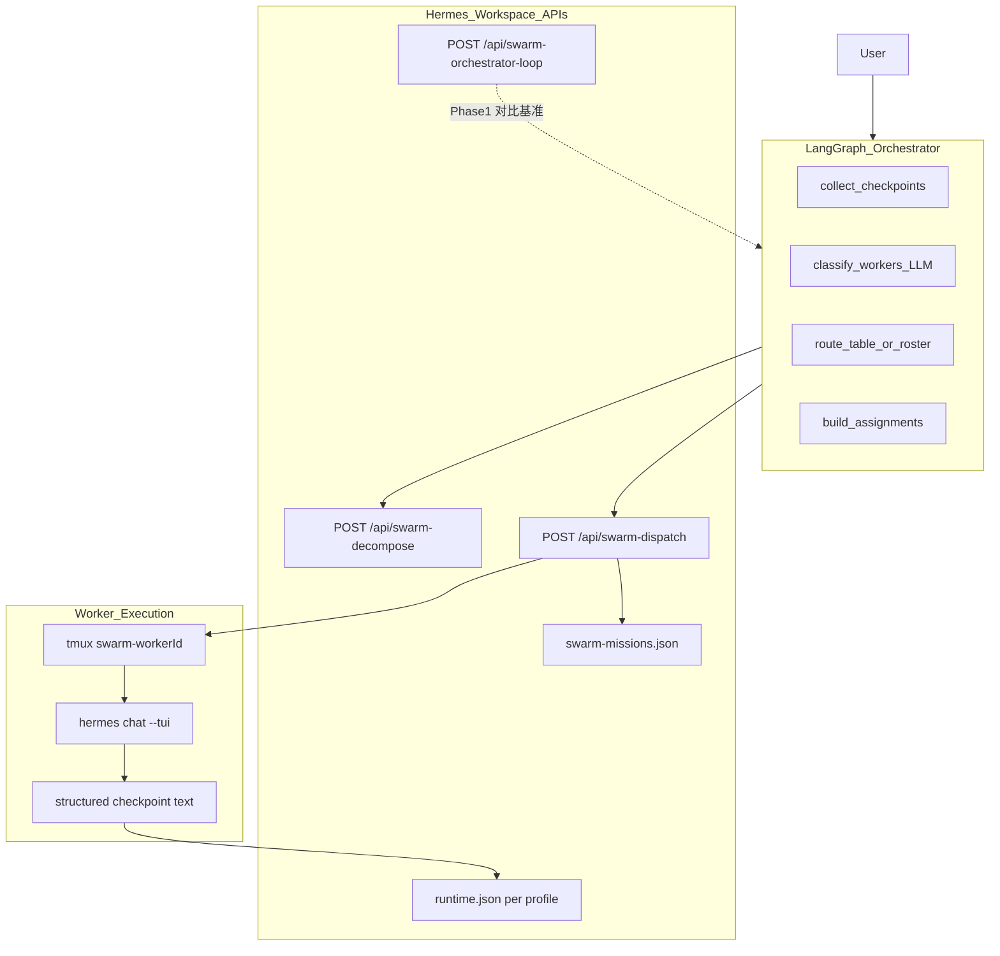
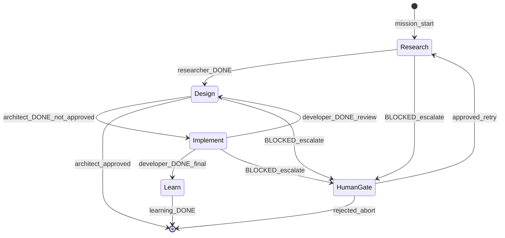
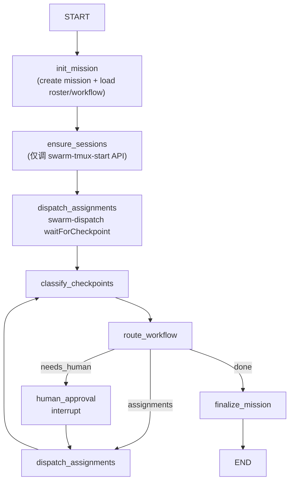

# LangGraph 编排 Swarm Worker 工作流方案

## 现状与定位

仓库里已有独立原型 [`hermes_langgraph_orchestrator/`](hermes_langgraph_orchestrator/)（[`graph.py`](hermes_langgraph_orchestrator/graph.py)、[`nodes.py`](hermes_langgraph_orchestrator/nodes.py)），通过 HTTP 调用 Workspace 现有 API，**不替代** tmux 派发与 checkpoint 机制。



**设计原则**（与 [`docs/swarm2-autopilot-orchestration-spec.md`](docs/swarm2-autopilot-orchestration-spec.md) 一致）：
- LangGraph 负责 **状态机 + 路由 + 人工门控**；LLM 仅做 **checkpoint 分类**（[`nodes.py`](hermes_langgraph_orchestrator/nodes.py) 已有此约束）
- Worker 执行仍走 [`swarm-dispatch.ts`](src/routes/api/swarm-dispatch.ts)（tmux paste-buffer + `waitForCheckpoint`）
- Roster 以 [`swarm.yaml`](swarm.yaml) 为能力真相源（当前 5 个 worker：`orchestrator`, `researcher`, `architect`, `developer`, `learning`）

**原型缺口**（需在方案中补齐）：
- `resolve_next()` 硬编码 CDC 流水线（researcher→architect→developer），**不读 roster**，且引用已删除的 `builder`/`reviewer`
- Phase 2 图未接入 `wait_for_checkpoints` / `log_execution`；`human_approval` 无 resume
- `start_workers` 与 dispatch 内 `ensureLiveTmuxSession` **重复启动 tmux**
- 无与 `swarm-missions.json` 状态机双向同步

---

## 目标工作流（以当前 roster 为例）

针对现有 5 worker，定义一条可运行的 **Research → Design → Implement → Learn** 流水线（可配置，非写死）：



`learning` worker 可作为复盘/文档化 lane；`orchestrator` 保留为 greenlight 门控与人工审批目标，不进入自动派发环。

---

## 核心状态模型

扩展 [`state.py`](hermes_langgraph_orchestrator/state.py)（Phase 1）与未来 Workspace 路由共用：

| 字段 | 用途 |
|------|------|
| `mission_id`, `mission_goal` | 关联 [`swarm-missions.ts`](src/server/swarm-missions.ts) |
| `roster_snapshot` | 启动时 `GET /api/swarm-roster` 缓存 |
| `workflow_spec` | 可配置 DAG/状态表（YAML 或 JSON） |
| `checkpoints` | 来自 dispatch 响应或 loop collect |
| `classifications` | LLM 结构化 verdict |
| `active_worker`, `pending_assignments` | 当前环状态 |
| `iteration`, `max_iterations` | 防死循环（developer↔architect 审查环） |
| `langgraph_needs_human` | 触发 interrupt |
| `thread_id` | LangGraph checkpointer 持久化 |

**LLM 边界**：`classify_workers` 输出 `WorkerClassification`（DONE/BLOCKED/NEEDS_INPUT + `blocker_type` + `review_outcome`）；**禁止** LLM 直接决定下一 worker，路由由图边 + 配置表完成。

---

## 路由层设计：从硬编码到 Roster 驱动

将 [`resolve_next()`](hermes_langgraph_orchestrator/nodes.py) 替换为两层：

1. **`workflow.yaml`**（新文件，例：`hermes_langgraph_orchestrator/workflows/cdc.yaml`）

```yaml
name: research_design_implement
entry: researcher
transitions:
  - from: researcher
    on: { verdict: DONE }
    to: architect
  - from: architect
    on: { verdict: DONE, review_outcome: approved }
    to: null
  - from: architect
    on: { verdict: DONE }
    to: developer
  - from: developer
    on: { verdict: DONE }
  to: architect
    max_iterations: 3
blockers:
  escalate: [architecture_decision, missing_credential]
  retry: [missing_dependency, test_failure, timeout]
```

2. **`route_by_workflow(classification, state) -> RouteDecision`**
   - 校验 `to` worker 在 roster 中存在且有 profile 目录
   - 无匹配 worker 时 fallback `orchestrator` 或 `needs_human`
   - 复用现有 `BLOCKER_ROUTE` 语义

启动时校验 workflow 节点 ⊆ `swarm.yaml` workers，避免引用不存在的 `builder`/`reviewer`。

---

## LangGraph 图（推荐 Phase 2 终态）

在 [`graph.py`](hermes_langgraph_orchestrator/graph.py) 基础上整理为单图 + mode 开关：



**与现 Phase 2 差异**：
- 删除节点内直接 `tmux new-session`（[`start_workers`](hermes_langgraph_orchestrator/nodes.py)）→ 统一 `POST /api/swarm-tmux-start`
- `initial_dispatch` 与 `dispatch_to_swarm` 合并为 `dispatch_assignments`
- 接入 `log_execution` 写 `logs/execute_*.json` + 更新 mission 事件

**终止条件**（`route_after_dispatch`）：
- workflow 到达终态（`to: null`）
- `iteration >= max_iterations`
- mission 被取消（轮询 `GET /api/swarm-missions`）
- 连续 N 次 BLOCKED escalate

---

## Phase 1：Python 侧验证（2–3 周）

**目标**：在 CLI 跑通完整 mission，决策质量优于 [`swarm-orchestrator-loop.ts`](src/routes/api/swarm-orchestrator-loop.ts) 规则引擎。

| 任务 | 说明 |
|------|------|
| 引入 `workflow.yaml` + roster 校验 | 替换硬编码 `resolve_next()` |
| 统一 session 启动 | 仅调 `/api/swarm-tmux-start`，删除重复 tmux spawn |
| 补齐 Phase 2 图接线 | `log_execution`、`check_done`、human resume CLI |
| Mission 对齐 | `init_mission` 调 dispatch 时带 `missionId`；分类结果写入 log |
| 对比模式保留 | Phase 1 graph 继续并行调用 loop API 做 A/B |
| 依赖锁定 | 新增 `hermes_langgraph_orchestrator/pyproject.toml` + `requirements.txt` |
| 场景测试 | `--scenario cdc` 对应当前 5 worker；mock collect 用于 CI |

**验收**：`python -m hermes_langgraph_orchestrator --execute --scenario cdc` 能从 mission goal 跑到 architect/developer 审查环结束，全程 checkpoint 可查。

---

## Phase 2：迁入 Workspace API + Swarm2 UI（3–4 周）

**目标**：UI 可启动/暂停/审批 LangGraph mission，不必手动跑 CLI。

### 2a. 新增 API（[`src/routes/api/`](src/routes/api/)）

| 路由 | 职责 |
|------|------|
| `POST /api/swarm-langgraph/run` | 启动图：`{ missionGoal, workflowId, workerIds?, maxIterations }` → `{ threadId, missionId }` |
| `GET /api/swarm-langgraph/status?threadId=` | 返回 `OrchestratorState` 摘要 + mission 状态 |
| `POST /api/swarm-langgraph/resume` | human approval 后继续（`Command(resume=...)`） |
| `POST /api/swarm-langgraph/cancel` | 取消 mission + 结束图 |

**实现方式**（混合路径推荐）：
- Node 路由作为 **薄代理**：`spawn` Python 子进程或连接本地 sidecar（`127.0.0.1:8765`）
- 子进程内跑已验证的 `build_phase2_graph()`，checkpointer 改用 **SQLite**（`~/.hermes/langgraph-checkpoints.db`）替代 `MemorySaver`
- 认证复用 `isAuthenticated`；`swarm_api_url` 指向本机 workspace

### 2b. Swarm2 UI 集成点

在 [`swarm2-screen.tsx`](src/screens/swarm2/swarm2-screen.tsx) / Router Chat：
- 新增 **Autopilot mode**：`manual`（现有）/ `langgraph`（新）
- Mission 面板展示：当前 active worker、iteration、最近 classification、pending human gate
- Human approval：复用现有 greenlight 交互模式，调 `/api/swarm-langgraph/resume`

### 2c. 与 orchestrator-loop 的关系

| 模式 | 编排大脑 |
|------|----------|
| `swarm-mode: manual` | 用户 + orchestrator agent |
| `swarm-mode: auto` | 现有 [`swarm-orchestrator-loop`](src/routes/api/swarm-orchestrator-loop.ts) 规则引擎 |
| `swarm-mode: langgraph` | LangGraph 图（新） |

三者共用同一 dispatch/mission 执行层，避免双写。

---

## 关键集成契约（保持不变）

LangGraph **只调用**以下 Workspace API，不直接操作 tmux/文件：

- `GET /api/swarm-roster` — 启动时加载 worker 能力
- `POST /api/swarm-decompose` — 可选，用于 mission 初始任务分解
- `POST /api/swarm-dispatch` — **唯一派发路径**（`waitForCheckpoint: true`, `timeoutSeconds: 600`）
- `POST /api/swarm-tmux-start` — 幂等预热 session
- `GET /api/swarm-missions` — 读 mission 状态 / 取消
- `GET /api/swarm-runtime` — UI 展示用（图内非必需）

Checkpoint 字段继续遵循 [`swarm-checkpoints.ts`](src/server/swarm-checkpoints.ts) 的 `STATE/FILES_CHANGED/COMMANDS_RUN/RESULT/BLOCKER/NEXT_ACTION` 格式。

---

## 风险与缓解

| 风险 | 缓解 |
|------|------|
| 长任务 HTTP 超时 | dispatch 已改为投递即返回 + 客户端轮询；LangGraph 侧用 `waitForCheckpoint` 但 socket 超时已在 [`vite.config.ts`](vite.config.ts) 豁免 |
| LLM 分类不稳定 | 低 temperature + 结构化 output；路由不依赖 LLM |
| developer↔architect 死循环 | `max_iterations` + escalate 到 human |
| roster/workflow 漂移 | 启动校验 + CI 测试 |
| Python/Node 双运行时 | Phase 1 验证后再迁入；checkpointer SQLite 可跨进程恢复 |

---

## 建议实施顺序

1. **workflow.yaml + roster 驱动路由**（去掉硬编码，适配当前 5 worker）
2. **统一 tmux 启动路径**（API only）
3. **补齐 Phase 2 图与 CLI resume**
4. **端到端 CDC 场景实测**（对比 orchestrator-loop）
5. **Workspace 薄代理 API + SQLite checkpointer**
6. **Swarm2 UI autopilot 面板**

此顺序符合你选择的 **混合部署**：先在 Python 侧证明图与路由可行，再产品化到 Workspace。
